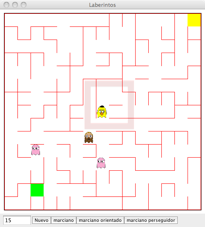

- (a) (4 puntos) Modifique la clase `Monitor.java` de la práctica 1 donde se han definido una serie de celdas como zona exclusiva en la que sólo puede haber una pieza dentro (o un marciano, o un jugador). Por ejemplo,



[comment]:	<p align="center">
[comment]:		
[comment]:	</p>

Suponga que las celdas tienen un método:

```java
public boolean isZonaExclusiva()
```

El comportamiento de las piezas del juego es así:

Cuando un jugador intenta pasar a una celda exclusiva:
	- si la zona exclusiva está vacía, entra;
	- si está ocupada, debe buscar otra celda.

Cuando un marciano intenta pasar a una celda exclusiva:
	- si la zona exclusiva está vacía, entra;
	- si está ocupada, espera a que se libere.

Tanto marcianos como jugador, cuando salen de la zona exclusiva hacia una celda que no lo es, liberan a los marcianos que pudieran estar esperando.

Sugerencia: se recomienda disponer de un campo

```java
private Object ocupado;
```

que se inicia a `null` y sirve para indicar qué objeto (jugador o marciano) está dentro de la zona. Sirve para comprobar si hay alguien dentro:

```java
private boolean estaZonaOcupada() { return ocupado != null; }
```

y para saber si salen:

```java
private boolean estoySaliendo(Jugador jugador, Celda celda2) {
    return ocupado == jugador && !celda2.isZonaExclusiva();
}

private boolean estoySaliendo(Marciano marciano, Celda celda2) {
    return ocupado == marciano && !celda2.isZonaExclusiva();
}
```


??? note "Mostrar solución"
	Una posible implementación es:
	```java
	package es.upm.dit.adsw.pract1;
	public class MonitorExtendido extends Monitor {

		private final Laberinto laberinto;
		private Object ocupado;

		public MonitorExtendido(Laberinto laberinto) {
			super(laberinto);
			this.laberinto = laberinto;
		}

		public synchronized void mueveJugador(Jugador jugador, Celda celda2)
				throws JugadorComido {

			if (celda2.isZonaExclusiva()) {
				if (estaZonaOcupada() && ocupado != jugador)
					return;
				else
					ocupado = jugador;
			}

			if (estoySaliendo(jugador, celda2)) {
				ocupado = null;
				notifyAll();
			}

			if (celda2.getEstado() == Estado.BICHO) {
				throw new JugadorComido();
			}

			jugador.setCelda(celda2);

			if (celda2.getTipo() == Tipo.LLAVE) {
				laberinto.limpiaCepos();
				notifyAll();
			}
		}

		public synchronized void mueveMarciano(Marciano marciano, Celda celda2)
				throws JugadorComido, InterruptedException {

			if (celda2.isZonaExclusiva()) {
				while (estaZonaOcupada() && ocupado != marciano)
					wait();
				ocupado = marciano;
			}

			if (estoySaliendo(marciano, celda2)) {
				ocupado = null;
				notifyAll();
			}

			if (celda2.getEstado() == Estado.BICHO) {
				return;
			}

			if (celda2.getEstado() == Estado.JUGADOR) {
				throw new JugadorComido();
			}

			marciano.setCelda(celda2);

			while (celda2.getTipo() == Tipo.CEPO) {
				wait();
			}
		}

		private boolean estaZonaOcupada() {
			return ocupado != null;
		}

		private boolean estoySaliendo(Jugador jugador, Celda celda2) {
			return ocupado == jugador && !celda2.isZonaExclusiva();
		}

		private boolean estoySaliendo(Marciano marciano, Celda celda2) {
			return ocupado == marciano && !celda2.isZonaExclusiva();
		}
	}
	```
