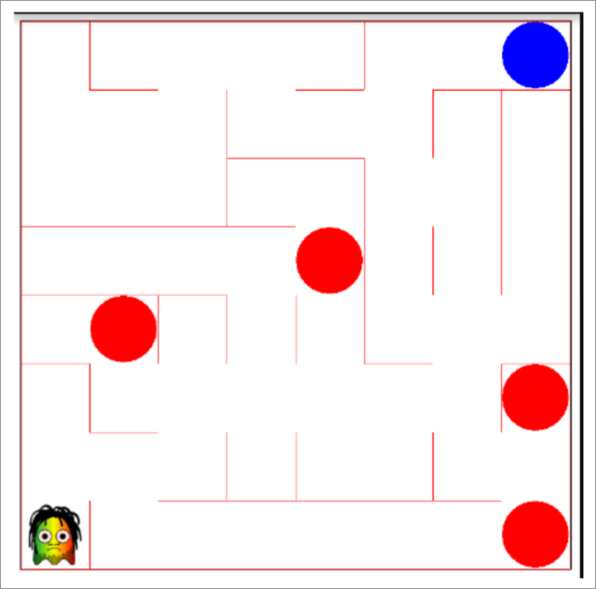

En el Juego del Pacman para Android tenemos un tablero de 8x8:



- (a) (1 punto) Indique las coordinadas `(x,y)` que debe pasar a `juego.pon(terreno.getCasilla(x.y), 0)` para poner un Patito (con identificador `0`) en la casilla con un círculo azul (objetivo) situada en el extremo superior derecho.

??? note "Mostrar solución"
    `X = 7, Y = 7`

- (b) (1 punto) Suponga que tenemos un gestor de eventos táctiles `onTouch(View v, MotionEvent event)`. Si pulsamos en el objetivo (círculo azul situado en el extremo superior derecho), ¿qué valores nos darán `x` e `y` si se calculan como sigue? 

```java
int x = (int) event.getX() / lado1; int y = (int) event.getY() / lado1
```

??? note "Mostrar solución"
    `X = 7, Y = 0`

Deseamos cambiar el comportamiento del gestor de eventos táctiles, de forma que el jugador ya no se mueva con el dedo. Queremos que al poner el dedo en una posición, aparezca un Patito si la casilla está vacía. El id de Patito registrado en Juego es 0. Además, queremos que muestre:

<ol>
    <li> Una traza informativa (<code>info</code>) al pulsar en la pantalla. Ej. “Pulso en (3, 4)”; </li>
    <li> Una traza de depuración (<code>debug</code>) cuando pone el patito. Ej. “Patito puesto en (3, 4)”; </li>
    <li> Una traza de depuración si no coincide la posición al poner y quitar el dedo, porque ha realizado algún movimiento. Ej. “No coinciden poner y quitar dedo”; </li>
    <li> Una traza de advertencia (<code>warn</code>) si ya hay algún móvil en esa posición. “Patito no puesto ya hay otro móvil”. </li>
</ol>

- (c) (3 puntos) Complete el código del método `onTouch()` que se da en la hoja de respuestas.

??? note "Mostrar solución"
    ```java
    private class MyTouchListener implements OnTouchListener {
        private float x1;
        private float y1;
    
        public boolean onTouch(View view, MotionEvent event) {
            Movil jugador = terreno.getJugador();
            Juego juego = Juego.getInstance();
            if (jugador == null) {
                return false;
            }
            int action = event.getAction();
            switch (action) {
                case MotionEvent.ACTION_DOWN: {
                    x1 = (int) (event.getX() / lado1);
                    y1 = terreno.getN() - 1 – (int) event.getY() / lado1);
                    Log.i(TAG, “Pulso en (“ + x1 + “ “ + y1 + “)”);
                    return true;
                }
                case MotionEvent.ACTION_UP: {
                    int x = (int) (event.getX() / lado1);
                    int y = terreno.getN() - 1 – (int) event.getY() / lado1);
                    if ((x != x1) || (y != y1)) {
                        Log.d(TAG, “No coinciden poner y quitar dedo”);
                        break;
                    }
                    if (x < terreno.getN() && y < terreno.getN()) {
                        if (terreno.getCasilla(x, y).getMovil() != null) {
                            Log.w(TAG, “Patito no puesto, ya hay otro móvil”);
                            break;
                        }
                        juego.pon(terreno.getCasilla(x, y), 0);
                        Log.d(TAG, "Patito puesto en (" + x + " " + y + ")");
                    }
                    break;
                }
                default:
            }
            return false;
        }
    }
    ```
    