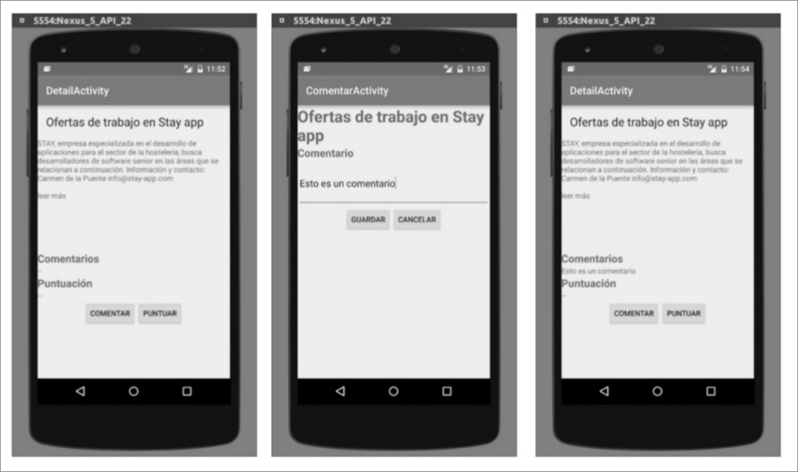

Queremos ampliar la práctica 7-8 de forma que junto con el detalle de cada noticia, cada usuario pueda valorarla o hacer un comentario. No necesita el código de la práctica para realizar este problema.

A continuación se le muestra una secuencia del uso de la nueva pantalla. El usuario parte de DetailActivity, donde ve la noticia (título y descripción) y aparecen los comentarios y la puntuación vacíos, junto con dos botones
(Comentar y Puntuar).

Si pincha en Comentar, va a la segunda pantalla (ComentarActivity), donde rellena el comentario y puede dar a Guardar o Cancelar. En ambos casos volverá a DetailActivity. En la imagen se muestra cómo ha pulsado Guardar y se muestra el comentario que el usuario ha introducido en DetailActivity.



A continuación, suponemos que el usuario da a Puntuar, en que introduce una puntación, y tiene las mismas opciones que en ComentarActivity. Suponemos que ha pulsado Guardar y vuelve a DetailActivity, donde se muestra la puntación asignada.


- (a) (5 puntos) Se pide:
    - Programe el código necesario para que DetailActivity tenga el nuevo botón Comentar y realice la funcionalidad descrita cuando se pincha en dicho botón:
        - 1. Muestre una pantalla ComentarActivity.
        - 2. Si el usuario pulsa Guardar en dicha pantalla, se vuelve a DetailActivity y se muestra el comentario escrito en la pantalla, junto con la traza informativa “Nuevo comentario”.
        - 3. Si el usuario pulsa Cancelar en dicha pantalla, se vuelve a DetailActivity y se muestra un Toast y una traza informativa con el contenido “El usuario no ha hecho comentarios”.

Nota: Suponga que están programados ya todos los layouts, así como las clases ComentarActivity y PuntuarActivity. Use las variables que necesite indicando dónde estarían definidas.

??? note "Mostrar solución"
    ```java
    public class DetailActivity extends AppCompatActivity {
        private static final String TAG = DetailActivity.class.getName();
        private static final int COMENTAR = 0;
        private static final int PUNTUAR = 1;
    
        private TextView comentarioTextView;
        private RssContent.EntryRss entry;
    
        @Override
        protected void onCreate(Bundle savedInstanceState) {
            super.onCreate(savedInstanceState);
            setContentView(R.layout.activity_detail);
    
            Bundle extras = getIntent().getExtras();
            if (extras == null) {
                Log.e(TAG, "Fallo - Debería recibir la noticia");
                finish();
            }
    
            entry = (RssContent.EntryRss) extras.getSerializable("entry");
            if (entry == null) {
                Log.e(TAG, "Entry mal recuperado");
                finish();
            }
    
            comentarioTextView = (TextView) findViewById(R.id.comentario);
            comentarioTextView.setText(entry.comentario);
    
            Button botonComentar = (Button) findViewById(R.id.comentar);
            botonComentar.setOnClickListener(new View.OnClickListener() {
                @Override
                public void onClick(View v) {
                    Log.d(TAG, "Comentar");
                    Intent i = new Intent(DetailActivity.this, ComentarActivity.class);
                    i.putExtra("titulo", entry.title);
                    startActivityForResult(i, COMENTAR);
                }
            });
        }
    
        @Override
        protected void onActivityResult(int reqCode, int resultCode, Intent data) {
            switch (reqCode) {
                case COMENTAR: {
                    if (resultCode == RESULT_OK) {
                        Log.i(TAG, "Nuevo comentario");
                        Bundle extras = data.getExtras();
                        String comentario = extras.getString("comentario");
                        comentarioTextView.setText(comentario);
                        entry.comentario = comentario;
                        RssContent.modifyEntryRss(entry); // almaceno cambio
                    } else {
                        String msg = "El usuario no ha hecho comentarios";
                        Log.i(TAG, msg);
                        Toast.makeText(getBaseContext(), msg, Toast.LENGTH_SHORT).show();
                    }
                    break;
                }
                case PUNTUAR: {
                    break;
                }
                default:
                    Log.e(TAG, "Acción inesperada");
                    finish();
            }
        }
    }
    ```
