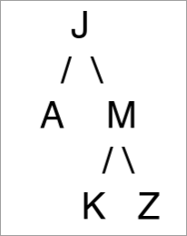
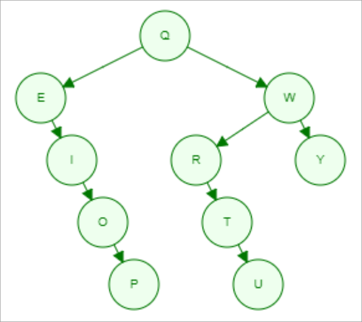

Dado el siguiente árbol binario:

- (a) (1,25 puntos) Escriba el resultado de recorrerlo en preorden.

??? note "Mostrar solución"
    J A M K Z

Tenemos un árbol binario de búsqueda (BST) en el que cada nodo almacena un carácter. 

- (b) (1,25 puntos) Dibuje el árbol resultante de insertar en la secuencia indicada las letras: Q W E R T Y U I O P.

??? note "Mostrar solución"
    