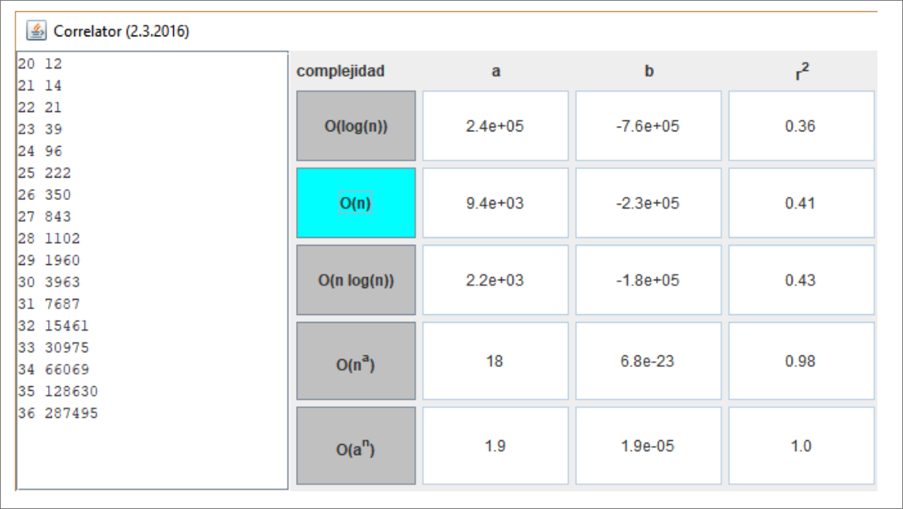

Vamos a trabajar el algoritmo del huevo. Sirve para modelar algoritmos de búsqueda rápida cuando las pruebas son destructivas, reemplazando a la búsqueda binaria en un array.

Tenemos `N` huevos y un edificio de `H` pisos. Queremos saber el piso más alto desde el que podemos dejar caer el huevo sin que se rompa. Con las siguientes suposiciones:

- Un huevo que sobrevive a una caída se puede usar nuevamente;
- Un huevo roto queda descartado;
- El efecto de una caída es el mismo para todos los huevos;
- Si un huevo rompe al caer desde un piso, romperá si se cae desde un piso superior;
- Si un huevo no rompe desde un piso, tampoco romperá desde un piso superior.

La búsqueda binaria no sirve. Por ejemplo, si solo tenemos un huevo `N=1`, el mejor algoritmo es la búsqueda lineal: ir tirando desde pisos consecutivos hasta que rompa. Si tenemos `N=2` huevos en un edificio de 100 plantas y probamos en el piso 50 y rompe, solo nos queda un huevo para 49 pruebas adicionales. El óptimo para `N=2` y `H=100` es empezar desde el piso 14. La búsqueda binaria vale cuando hay más huevos que pisos.

Para averiguar el piso óptimo solo necesitamos tener en cuenta cuántos pisos tenemos para probar. Es decir, es lo mismo buscar en los pisos del 1 al 10 que entre el 71 y el 80.

Para averiguar el número máximo de pruebas con `N` huevos y `H` pisos podemos usar un método recursivo:
```java
def drops(n, h):
    if n == 1:
        return h
    if h < 2:
        return h
    res = 1000
    for x in range(1, h + 1):
        res = min(
            res,
            1 + max(drops(n - 1, x - 1), drops(n, h - x))
        return res;
```

Simplemente probamos todos los pisos `X` en el rango de pisos y para cada uno de ellos tenemos 2 opciones:

- Que el huevo se rompa y tenemos `N-1` huevos y `X-1` pisos;
- Que el huevo no rompa y tenemos `N` huevos y `H-X` pisos.

Probamos este código y va muy muy lento. Medimos tiempos para `N=2` y obtenemos esto:



- (a) (2,5 puntos) Indicar la complejidad del algoritmo recursivo en función de `H`. No se pide que la calcule analíticamente, solo que la marque y la valide a partir de las medidas realizadas.

??? note "Mostrar solución"
    Estudio de opciones en base al coeficiente de correlación.

    | Complejidad     | r     | Evaluación     |
    |-----------------|-------|----------------|
    | $O(log h)$      | 0.36  | NO, $r << 1.0$ |
    | $O(h)$          | 0.41  | NO, $r << 1.0$ |
    | $O(h log h)$    | 0.43  | NO, $r << 1.0$ |
    | $O(h^18)$       | 0.98  | Posible        |
    | $O(1.9^h)$      | 1.00  | Posible        |

    De las 2 opciones posibles, es absurdo que en un algoritmo recursivo como el presentado aparezca un polinomio de orden 18.

    Sí es posible una complejidad $O(2^h)$, que es probablemente la solución.

    Del análisis de la relación de recurrencia, para `N=2`, tenemos un bucle interno sobre `x` que se ejecuta `h` veces en forma de serie aritmética:

    $T(n, h-1) + T(n, h-2) + … + T(n, 1)$

    $= h * (T(n, h-1) + T(n, 1)) / 2$

    $≈ h * T(n, h-1)$

    El algoritmo completo queda definido por la recurrencia:

    $T(h) = h * T(h-1)$

    Intentamos validar la solución propuesta:

    $T(h) = 2^h$

    Sustituyendo en la recurrencia:

    $2^h = h * 2^{h-1}$

    Esta igualdad se cumple para $h >> 1$ (cuando `h` tiende a infinito).

    Para `n` constante, el algoritmo tiene complejidad $O(2^h)$.


Como el algoritmo recursivo no es práctico, recurrimos a memorizar resultados intermedios, de forma similar a como se hace con las series de Fibonacci.
```java
01  int eggDrop(int n, int h) {
02      int[][] cache = new int[n + 1][h + 1];
03      for (int i = 1; i <= n; i++) {
04          cache[i][1] = 1;
05          cache[i][0] = 0;
06      }
07      for (int j = 1; j <= h; j++)
08          cache[1][j] = j;
09      for (int i = 2; i <= n; i++) {
10          for (int j = 2; j <= h; j++) {
11              int min = Integer.MAX_VALUE;
12              for (int x = 1; x <= j; x++) {
13                  int res = 1 + Math.max(cache[i - 1][x - 1],
14                                          cache[i][j - x]);
15                  min = Math.min(min, res);
16              }
17              cache[i][j] = min;
18          }
19      }
20      return cache[n][h];
21  }
```

- (b) (2,5 puntos) Se pide que calcule la complejidad de la implementación iterativa, en función de `N` y `H`. Se valorará la corrección de los razonamientos usados para determinar la complejidad.

??? note "Mostrar solución"
    | Línea | Complejidad                                       |
    | ----- | ------------------------------------------------- |
    |     2 | $O(1)$                                            |
    |   3–6 | $n · O(1) = O(n)$                                 |
    |   7–8 | $h · O(1) = O(h)$                                 |
    |     9 | $n · ...(bucle$ `for`$)$                          |
    |    10 | $h · ...(bucle$ `for`$)$                          |
    |    11 | $O(1)$                                            |
    |    12 | $h · ...(bucle$ `for`$)$                          |
    | 13–15 | $O(1)$                                            |
    | 12–16 | $h · O(1) = O(h)$                                 |
    |    17 | $O(1)$                                            |
    | 10–18 | $h · (O(1) + O(h) + O(1)) = O(h^2)$               |
    |  9–19 | $n · O(h^2) = O(n·h^2)$                           |
    |    20 | $O(1)$                                            |
    |  2–21 | $O(1) + O(n) + O(h) + O(n·h^2) + O(1) = O(n·h^2)$ |
    
    Hemos convertido un algoritmo recursivo de orden exponencial en un algoritmo iterativo de orden cuadrático.
