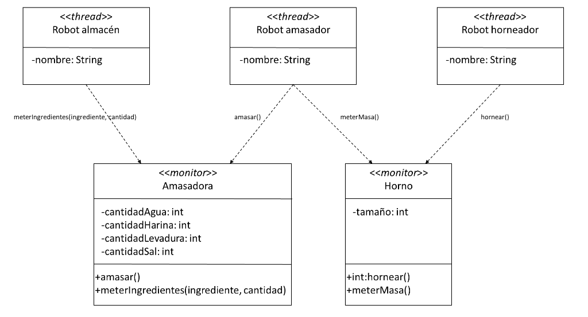

La panadería Molinga S.L. quiere modernizar sus instalaciones robotizando su sistema de producción de pan. Para ello han encargado a los alumnos de ADSW que realicen parte del sistema.

Se desea realizar dos monitores para gestionar la amasadora y el horno de la panadería, con acceso exclusivo por parte de varios robots (threads). Existen 3 tipos de robots en la panadería:
    - Robots de almacén, que meten ingredientes en la amasadora.
    - Robots amasadores, que cuando tienen los ingredientes necesarios amasan y después meten la masa en el horno.
    - Robots horneadores, que cuando tienen las masas necesarias para llenar un horno, hornean el pan.

La amasadora permitirá introducir ingredientes a los r obots de almacén y amasar a los robots amasadores. Para hacer una masa de pan hacen falta cuatro ingredientes: agua, harina, levadura y sal, en la proporción de 4, 3, 2 y 1 unidades. No se permitirá a los robots de almacén introducir más ingredientes si hay suficientes para hacer una masa, y de igual manera no se permitirá a los robots amasadores amasar si no hay suficientes ingredientes para
hacer una masa.

El horno permitirá introducir masas a los robots amasadores y hornear a los robots horneadores. Un horno tiene un tamaño concreto, que recibirá como parámetro en el constructor, indicando el número de masas que es capaz de hornear. Por motivos de eficiencia, los robots horneadores solo podrán hornear si el horno está completamente lleno, y los robots amasadores solo podrán meter masas si hay hueco en el horno.

Estructura de clases de la panadería:



Ejemplo de programa con varios robots:
```java
public enum Ingrediente {
    Agua, Harina, Levadura, Sal
}

public static void main(String[] args) {
    Amasadora amasadora = new Amasadora();
    Horno horno = new Horno(5);
    new RobotAlmacen("ED209",amasadora).start();
    new RobotAlmacen("T-800",amasadora).start();
    new RobotAlmacen("WALL-E",amasadora).start();
    new RobotAlmacen("Bumblebee",amasadora).start();
    new RobotAmasador("R2D2",amasadora,horno).start();
    new RobotAmasador("C3PO",amasadora,horno).start();
    new RobotAmasador("BB8",amasadora,horno).start();
    new RobotHorneador("Chappie",horno).start();
    new RobotHorneador("RoboCop",horno).start();
}
```

Ejemplo de código del robor horneador:
```java
public class RobotHorneador extends Thread {
    private Horno horno;
    private String nombre;
    private int panes = 0;
    private Random random = new Random();

    public RobotHorneador(String nombre, Horno horno) {
        this.horno = horno;
        this.nombre = nombre;
        this.panes = 0;
    }

    public String getNombre() {return this.nombre;}

    public void run() {
        while (true) {
            try {
                int panesNuevos = this.horno.hornear();
                this.panes = this.panes + panesNuevos;
                Thread.sleep(random.nextInt(5000));
            } catch (InterruptedException ignored) {
            }
        }
    }
}
```

- (a) (2,5 puntos) Desarrollar el monitor Amasadora

??? note "Mostrar solución"
    ```java
    public class Amasadora {
        private int cantidadAgua;
        private int cantidadHarina;
        private int cantidadLevadura;
        private int cantidadSal;

        public synchronized void amasar() {
            try {
                while (!((this.cantidadAgua >= 4) && (this.cantidadHarina >= 3) &&
                       (this.cantidadLevadura >= 2) && (this.cantidadSal >= 1))) {
                    wait();
                }
                this.cantidadAgua = this.cantidadAgua - 4;
                this.cantidadHarina = this.cantidadHarina - 3;
                this.cantidadLevadura = this.cantidadLevadura - 2;
                this.cantidadSal = this.cantidadSal - 1;
                notifyAll();
            } catch (InterruptedException ignored) {}
        }

        public synchronized void meterIngredientes(Ingrediente ingrediente, int cantidad) {
            try {
                while (((this.cantidadAgua >= 4) && (this.cantidadHarina >= 3) &&
                       (this.cantidadLevadura >= 2) && (this.cantidadSal >= 1))) {
                    wait();
                }
                switch (ingrediente) {
                    case Agua:
                        this.cantidadAgua = this.cantidadAgua + cantidad;
                        break;
                    case Harina:
                        this.cantidadHarina = this.cantidadHarina + cantidad;
                        break;
                    case Levadura:
                        this.cantidadLevadura = this.cantidadLevadura + cantidad;
                        break;
                    case Sal:
                        this.cantidadSal = this.cantidadSal + cantidad;
                        break;
                }
                notifyAll();
            } catch (InterruptedException ignored) {}
        }
    }
    ```java


- (b) (2 puntos) Desarrollar el monitor Horno

??? note "Mostrar solución"
    ```java
    public class Horno {
        private int masas;
        private int tamaño;
    
        public Horno(int tamaño) {
            this.tamaño = tamaño;
        }
    
        public synchronized int hornear(String nombre) {
            try {
                while (!(this.masas >= this.tamaño)) {
                    wait();
                }
                this.masas = this.masas - this.tamaño;
                notifyAll();
            } catch (InterruptedException ignored) {}
            return this.tamaño;
        }
    
        public synchronized void meterMasa(String nombre) {
            try {
                while (this.masas >= this.tamaño) {
                    wait();
                }
                this.masas++;
                notifyAll();
            } catch (InterruptedException ignored) {}
        }
    }
    ```


- (c) (0,5 puntos) Proponer el método run() del Robot Amasador

??? note "Mostrar solución"
    ```java
    public void run() {
        while (true) {
            amasadora.amasar();
            horno.meterMasa();
        }
    }
    ```

