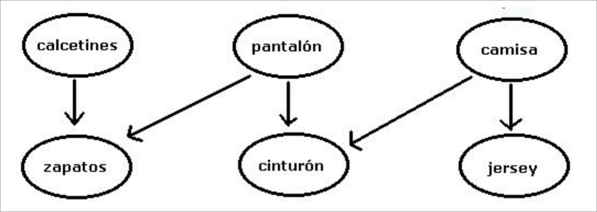

Una ordenación topológica (*topological sort*) de un grafo dirigido `G` es una lista con todos los nodos de `G` tal que no existe ningún enlace hacia atrás. 



Ejemplos:

- correcto: `[calcetines, camisa, pantalón, jersey, cinturón, zapatos]`
- correcto: `[pantalón, camisa, jersey, calcetines, zapatos, cinturón]`
- correcto: `[pantalón, calcetines, zapatos, camisa, jersey, cinturón]`
- incorrecto: `[pantalón, cinturón, calcetines, zapatos, CAMISA, jersey]`

La última ordenación es incorrecta porque camisa debería estar antes que cinturón.

Suponga que tenemos un grafo de `N` nodos y una media de 5 enlaces por nodo. 

- (a) (2,5 puntos) Haga suposiciones razonadas sobre la complejidad de las llamadas a los métodos de `Graph`, en función del tamaño `N` del grafo.

??? note "Mostrar solución"
    | Método                  | Complejidad |
    |-------------------------|-------------|
    | `graph.getNodes()`      | $O(1)$ si se ha implementado con una `List` que se va cargando cuando se añaden nodos al grafo (lo habitual en el ejercicio 1 entregado). |
    |                         | $O(n)$ si se calcula al llamar a la función agregando las tablas de nodos con enlaces (frecuente en el ejercicio 2 entregado). |
    | `graph.getNode(String)` | $O(n)$ si hay que recorrer la lista hasta encontrar el nodo (lo habitual en el ejercicio 1 entregado). |
    |                         | $O(1)$ si hay un diccionario que asocia el nombre al nodo (lo habitual en el ejercicio 2 entregado). |
    | `graph.getLinks(Node)`  | $O(n)$ si hay que recorrer la lista hasta encontrar el nodo (lo habitual en el ejercicio 1 entregado). |
    |                         | $O(1)$ si hay un diccionario que asocia el nodo a los enlaces (lo habitual en el ejercicio 2 entregado). |


- (b) (2,5 puntos) Calcule la complejidad del método `sort()` en función de `N`.

??? note "Mostrar solución"
    Partimos de la implementación del algoritmo proporcionada con el enunciado.
    ```java
    24    public List<Node> sort() {
    25       List<Node> L = new ArrayList<>();
    26       List<Node> S = new ArrayList<>();
    27
    28       List<Node> nodeList = graph.getNodes();
    29        for (Node n : nodeList) {
    30            if (inLinks.get(n).size() == 0)
    31                S.add(n);
    32        }
    33
    34        while (S.size() > 0) {
    35            int i = (int) (Math.random() * S.size());
    36            Node n = S.remove(i);
    37            L.add(n);
    38            List<Link> linkList = graph.getLinks(n);
    39            for (Link link : linkList) {
    40                Node dst = graph.getNode(link.getDst());
    41                List<Link> links = inLinks.get(dst);
    42                links.remove(link);
    43                if (links.size() == 0)
    44                    S.add(dst);
    45            }
    46        }
    47
    48        return L;
    49    }
    ```

    Si todas las operaciones en `Graph` se optimizan a $O(1)$, la complejidad del conjunto viene condicionada por el coste de extraer un elemento aleatorio de `S` (en la línea 36).

    Se podría prescindir de la aleatoriedad extrayendo el último elemento de la lista, que es una operación $O(1)$.
    ```java
    Node n = S.remove(S.size()-1)
    ```
    Y el algoritmo quedaría $O(n)$.
