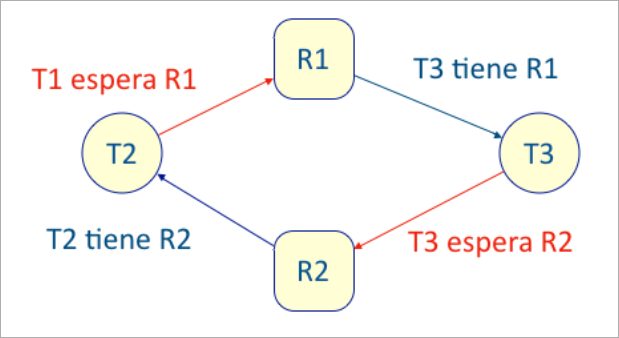

Se desea realizar un monitor para gestionar un tipo de recursos con acceso exclusivo por parte de varias hebras (threads). Para ello se parte del esquema de la clase Recurso:
```java
public class Recurso {
    private int n = 0;
    // número de usuarios del recurso

    public ... void adquirir() {
        ...
        // assert n == 1;
    }

    public ... void liberar() {
        ...
        // assert n == 0
    }
}
```

- (a) (2,5 puntos) Complete el código de la clase Recurso de forma que se cumplan las aserciones que figuran como comentarios.

??? note "Mostrar solución"
    Una posible implementación de la clase Recurso es:
    ```java
    public class Recurso {
        private int n = 0; // número de usuarios del recurso
    
        public synchronized void adquirir() {
            while (n > 0)
                try {
                    wait();
                } catch (ExceptionIgnored) {}
            n++;
            assert n == 1;
        }
    
        public class Recurso {
            private int n = 0;
            // número de usuarios del recurso
    
            public ... void adquirir() {
                ...
                // assert n == 1;
            }
    
            public ... void liberar() {
                ...
                // assert n == 0
            }
        }
    
        public synchronized void liberar() {
            n--;
            notifyAll();
            assert n == 0;
        }
    }
    ```
    
Se crean tres hebras, T1, T2 y T3, cuyos métodos run incluyen los siguientes accesos a dos objetos, R1 y R2, de la clase Recurso:
```java
- T1: R1.adquirir(); R1.liberar(); ... R2.adquirir(); R2.liberar();
- T2: R2.adquirir(); R1.adquirir(); ... R1.liberar(); R2.liberar();
- T3: R1.adquirir(); R2.adquirir(); ... R2.liberar(); R1.liberar();
```

- (b) (2,5 puntos) Analice el comportamiento de este programa, indicando si se pueden producir interbloqueos entre todas o algunas de las hebras. Justifique la respuesta mediante las condiciones de interbloqueo explicadas en clase. NOTA : no hace falta implementar las hebras T1, T2, T3, ni los métodos run() respectivos.

??? note "Mostrar solución"
    Examinamos las condiciones de Coffman:
        - Exclusión mutua: las tres hebras acceden a los recursos de forma mutuamente exclusiva, por medio de los métodos adquirir() y liberar(). Por tanto esta condición se cumple para las tres hebras.
        - Tener y esperar: La hebra T1 sólo adquiere un recurso a la vez. T2 accede a R2 y luego a R1, y la hebra T3 accede a R1 y luego R2. Por tanto, la condición se cumple para T2 y T3, pero no para T1.
        - Sin expulsión: La implementación de los métodos adquirir() y liberar() no permite expulsar a una hebra de un recurso ya adquirido. Por tanto, esta condici´n se cumple para todas las hebras.
        - Espera circular: Se puede producir una espera circular entre T2 y T3, como se muestra en el siguiente esquema:

    