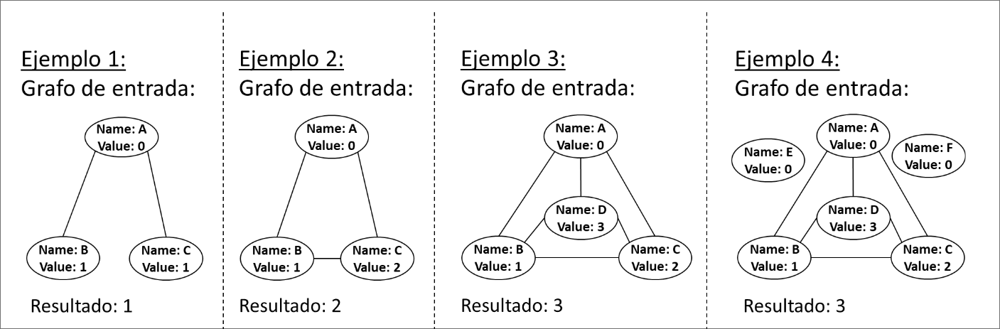

Se debe realizar un algoritmo para etiquetar con un número todos los nodos de un grafo cumpliendo las siguientes condiciones:
    - 1. Dos nodos adyacentes no pueden tener el mismo número.
    - 2. Sobre el grafo pasado como parámetro, el algoritmo debe asignar el número mínimo que pueda a todos los nodos, cumpliendo la condición del punto 1, y devolver el número máximo utilizado para etiquetar todos los nodos. (Ver ejemplos).
    - 3. Se considera que todos los enlaces son bidireccionales y se han creado con el siguiente método:
    ```java
    public void addLink2D(String a, String b, int w) {…}
    ```
    que añade a un grafo un enlace entre el nodo a y el b, y otro enlace entre b y a. Todos los enlaces tiene peso w = 1.
    - 4. Se usará el modelo de los ejercicios de prácticas 1 y 2, donde tenemos la clase Graph que contiene objetos de la clase Node para definir los vértices (nodos), y objetos de la clase Link para definir los arcos (enlaces.)

Notas: Una posible solución trivial podría ser hacer un for con un índice y asignar ese índice a cada nodo. Esta solución no sería válida porque, aunque cumple el punto 2, no cumple el punto 3. Para asignar valores a los nodos se recomienda usar una estructura del estilo Map<Node, Integer>, donde la clave (key) es el Node que queremos etiquetar y el valor (value) es el Integer con el valor etiquetado.

Ejemplos:



- (a) (4 puntos) Diseñe el algoritmo con la siguiente signatura. Nota: Puede (debe) desarrollar métodos auxiliares si lo necesita para facilitar la implementación del algoritmo.
```java
int getMinimunInt(Graph g) {
    // a rellenar por el alumno
}
```

??? note "Mostrar solución"
    ```java
    /**
     * Método para conseguir una lista con todos enteros de los nodos vecinos a uno dado.
     * Si el vecino no tiene un entero asignado, no se devuelve nada.
     *
     * @param g Grafo del que se quiere realizar los cálculos
     * @param myNode Nodo del cual se quiere obtener todos los vecinos
     * @param ints Mapa con los enteros de todos los nodos
     * @return Lista de los colores de los vecinos
     */
    public static List<Integer> getNeighborsInts(Graph g, Node myNode, Map<Node, Integer> ints) {

        List<Integer> neighborsInts = new ArrayList<Integer>();

        for (Link link : g.getLinks(myNode)) {
            Node dst = g.getNode(link.getDst());
            if (dst != null) {
                Integer intDst = ints.get(dst);
                if (intDst != null) {
                    neighborsInts.add(intDst);
                }
            }
        }
        return neighborsInts;
    }

    /**
     * Algoritmo para conseguir el entero mínimo de una lista de Integers dada.
     *
     * Ejemplos:
     * <1,2,3>  -> devuelve 0
     * <0,1,3>  -> devuelve 2
     * <0,1,2>  -> devuelve 3
     *
     * @param neighborsInts lista con enteros
     * @return entero mínimo que no está en la lista
     */
    public static int getMinimunInt(List<Integer> neighborsInts) {

        for (int i = 0; i != Integer.MAX_VALUE; i++) {
            boolean found = false;

            for (Integer myInteger : neighborsInts) {
                if (myInteger.intValue() == i) {
                    found = true;
                    break;
                }
            }

            if (!found) {
                return i;
            }
        }
        return Integer.MAX_VALUE;
    }

    /**
     * Algoritmo para conseguir el entero mayor (máximo) de un mapa.
     *
     * @param ints mapa con los nodos y el entero asignado
     * @return entero máximo del mapa
     */
    public static int getMaxIntInGraph(Map<Node, Integer> ints) {

        int maxValue = Integer.MIN_VALUE;

        for (Integer myInteger : ints.values()) {
            if (myInteger.intValue() > maxValue) {
                maxValue = myInteger.intValue();
            }
        }
        return maxValue;
    }

    /**
     * Algoritmo para conseguir el entero mínimo para etiquetar un grafo
     * siguiendo las reglas del coloreado de grafos.
     *
     * @param g grafo que describe el problema
     * @return entero mínimo necesario para etiquetar el grafo
     */
    public static int getMinimunInt(Graph g) {

        // Estructura para guardar los enteros asignados a cada nodo
        Map<Node, Integer> ints = new HashMap<Node, Integer>();

        // Recorremos todos los nodos del grafo
        for (Node myNode : g.getNodes()) {

            // Obtenemos los enteros de los vecinos
            List<Integer> neighborsInts = getNeighborsInts(g, myNode, ints);

            // Calculamos el entero mínimo no usado
            int minimunInt = getMinimunInt(neighborsInts);

            // Asignamos el entero al nodo
            ints.put(myNode, minimunInt);
        }

        // Obtenemos el entero máximo usado en el grafo
        int maxIntInGraph = getMaxIntInGraph(ints);

        return maxIntInGraph;
    }
    ```


- (b) (1 punto) ¿Cuál es la complejidad de dicho algoritmo? (Razone su respuesta)

??? note "Mostrar solución"
    La solución dependerá de la respuesta a la pregunta (a).
