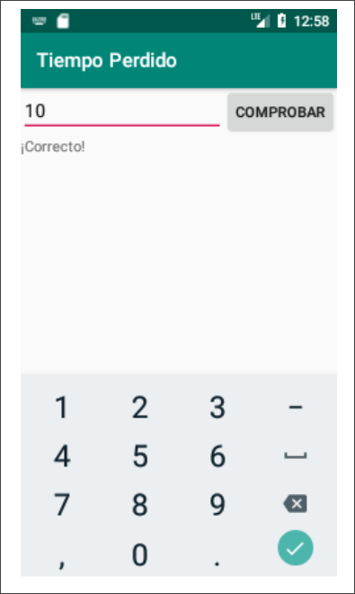

Se desea desarrollar una aplicación llamada 'Tiempo Perdido', cuya funcionalidad es comparar el tiempo en segundos que la aplicación ha estado completamente visible con un valor introducido por el usuario. Para ello se ha diseñado la siguiente interfaz gráfica:



En ella se han emplazado los siguientes elementos:

- Un `EditText` con `id`: `etNumber` e `inputType: number`. Este último atributo solo permite al usuario introducir números enteros no negativos.
- Un `TextView` con `id: tvResult` donde se muestra el resultado de la comparación.
    - Si el valor introducido por el usuario coincide con el tiempo en segundos que la aplicación ha estado completamente visible indica “¡correcto!”.
    - Si el usuario introduce un valor mayor indica “Te has pasado por X segundos” donde `X` es la diferencia entre el valor introducido y el correcto.
    - Si el usuario introduce un valor menor indica “Te has quedado corto por X segundos” donde `X` es la diferencia entre el valor introducido y el correcto.
- Un botón con `id: bComprobar` que lanza la comprobación. Si al pulsar el botón `etNumber` no contiene un número no negativo se ha de lanzar un mensaje de alerta al usuario.

Para la implementación nos apoyaremos en la clase `Chrono` que ofrece los siguientes métodos:

```java
public class Chrono {
    int time;
    public Chrono() {
        this.time = 0;
    }
    // Arranca el cronómetro
    public void startChrono (){…}
    // Para el cronómetro
    public void stopChrono (){…}
    // Reinicia el cronómetro a 0
    public void resetChrono (){time = 0;}
    // Devuelve el valor del cronómetro en segundos
    public int currentTime() {return time;}
}
```

- (a) (3 puntos) Complete la clase para implementar la funcionalidad descrita.

??? note "Mostrar solución"
    ```java
    public class MainActivity extends AppCompatActivity {
    
        Chrono chrono;
        EditText input;
        TextView output;
        Button check;
    
        @Override
        protected void onCreate(Bundle savedInstanceState) {
            super.onCreate(savedInstanceState);
            setContentView(R.layout.activity_main);
    
            chrono = new Chrono();
            input = findViewById(R.id.etNumber);
            output = findViewById(R.id.tvResult);
            check = findViewById(R.id.bComprobar);
    
            check.setOnClickListener(new View.OnClickListener() {
                public void onClick(View w) {
                    String st = input.getText().toString();
    
                    if (st == null || st.isEmpty()) {
                        Toast.makeText(
                            MainActivity.this,
                            "Introduce un número entero positivo",
                            Toast.LENGTH_SHORT
                        ).show();
                        return;
                    }
    
                    Integer in = Integer.parseInt(st);
                    if (in != null && in >= 0) {
                        int diff = in.intValue() - chrono.currentTime();
    
                        if (diff == 0) {
                            output.setText("¡Correcto!");
                        } else if (diff > 0) {
                            output.setText("Te has pasado por " + diff + " segundos.");
                        } else {
                            output.setText("Te has quedado corto por " + (-diff) + " segundos.");
                        }
                    }
                }
            });
        }
    
        @Override
        protected void onResume() {
            super.onResume();
            chrono.startChrono();
        }
    
        @Override
        protected void onStop() {
            super.onStop();
            chrono.stopChrono();
        }
    }
    ```