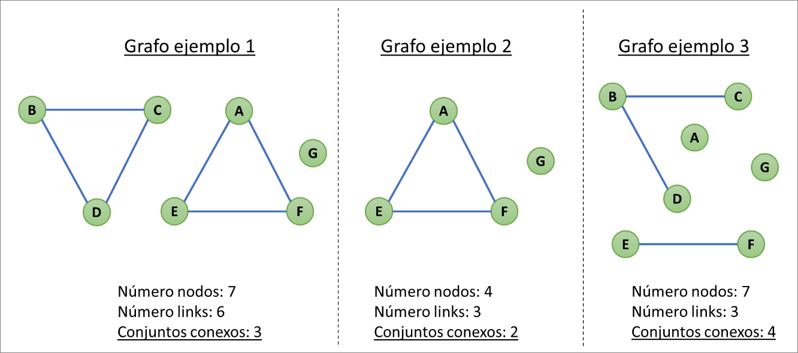

Queremos un algoritmo para calcular el número de conjuntos conexos de un grafo no dirigido. Usaremos el modelo de los ejercicios 1 y 2, donde la clase Graph contiene objetos de la clase Node (nodos) y objetos de la clase Link (arcos o enlaces dirigidos ponderados). En lo sucesivo consideraremos que todos los enlaces se han creado con el método:
```java
public void addLink2D (String a, String b, int w) {...}
```

De esta manera se garantiza que todos los enlaces son bidireccionales.

Un conjunto conexo es un conjunto de nodos de un grafo unidos por enlaces directa o indirectamente. Un conjunto de nodos es conexo si existe al menos un camino entre todos los pares de vértices.

Ejemplos:



- (a) (4 puntos) Diseñe el algoritmo con la siguiente signatura. Nota: Puede desarrollar métodos auxiliares si lo necesita.
```java
int conjuntosConexos(Graph g) {
    //TODO a rellenar por el alumno
}
```

??? note "Mostrar solución"
    Metodos comunes:
    ```Java
    /**
     * Algoritmo para conseguir todos los nodos vecinos a uno dado.
     *
     * @param g Grafo del que se quiere realizar los cálculos
     * @param myNode Nodo del cual se quiere obtener todos los vecinos
     * @return Lista de nodos vecinos a myNode
     */
    List<Node> getNeighbors(Graph g, Node myNode) {

        List<Node> neighbors = new ArrayList<>();

        for (Link link : g.getLinks(myNode)) {
            Node dst = g.getNode(link.getDst());
            if (dst != null) {
                neighbors.add(dst);
            }
        }
        return neighbors;
    }
    ```
    
    Solución Iterativa:
    ```java
    int conjuntosConexos(Graph g) {
        int zones = 0;

        // Se usan dos listas, una para los nodos visitados y otra los que vamos a visitar.
        List<Node> toVisit = new ArrayList<>();
        List<Node> visited = new ArrayList<>();
        Node aNode;

        // Para todos los nodos
        for (Node myNode : g.getNodes()) {
            if (!visited.contains(myNode)) {

                // Cada vez que se encuentra un nodo no visitado se añade una zona.
                zones++;

                // Se añade el nodo en la lista de nodos que hay que visitar
                toVisit.add(myNode);

                // Mientras queden nodos que visitar
                while (toVisit.size() > 0) {

                    // Se toma el primero
                    aNode = toVisit.get(0);

                    // Se añade a los visitados y se quita de los no visitados
                    visited.add(aNode);
                    toVisit.remove(aNode);

                    // Se marcan para visitar todos los vecinos que no estén visitados
                    for (Node neighbour : getNeighbors(g, aNode)) {
                        if (!visited.contains(neighbour)) {
                            toVisit.add(neighbour);
                        }
                    }
                }
            }
        }
        return zones;
    }
    ```

    Solución Recursiva:
    ```java
    /**
     * Algoritmo recursivo que añade todos los nodos del conjunto conexo a la lista
     * visitados
     *
     * @param g Grafo del que se quiere calcular el conjunto conexo
     * @param myNode Nodo donde se empieza a calcular el conjunto conexo
     * @param visited Lista de nodos con los nodos visitados
     */
    void visitZone(Graph g, Node myNode, List<Node> visited) {

        // Se añade el nodo al conjunto de visitados
        visited.add(myNode);

        // Se obtienen los nodos vecinos
        List<Node> neighbors = getNeighbors(g, myNode);

        // Para todos los vecinos
        for (Node nodeNeighbour : neighbors) {

            // Si no han sido visitados
            if (!visited.contains(nodeNeighbour))

                // Se llama recursivamente a este algoritmo para ser visitado
                visitZone(g, nodeNeighbour, visited);
        }
    }

    int conjuntosConexos(Graph g) {

        // Se inicializan las zonas a 0
        int zones = 0;

        // Lista de nodos visitados (compartida en las llamadas recursivas)
        List<Node> visited = new ArrayList<>();

        // Para todos los nodos del grafo
        for (Node myNode : g.getNodes()) {

            // Si no está visitado
            if (!visited.contains(myNode)) {

                // Se ha descubierto una zona nueva
                zones++;

                // Se visita esa zona usando el algoritmo recursivo
                visitZone(g, myNode, visited);
            }
        }
        return zones;
    }
    ```


- (b) (1 punto) ¿Qué tipo de algoritmo ha diseñado? Recursivo/iterativo (Razone su respuesta) 

??? note "Mostrar solució"
    La solución dependerá del algoritmo desarrollado en la pregunta (a).