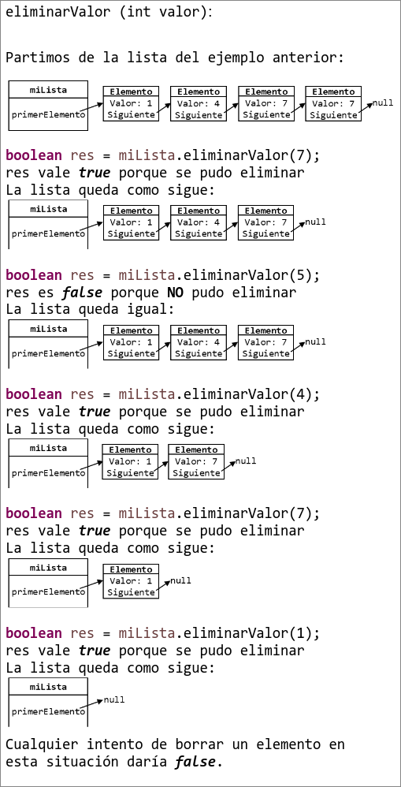

La solución debe presentarse en Java y comentando lo que hace el código. Alternativamente se puede presentar la solución en pseudocódigo.

Se debe implementar los tres métodos principales de una clase llamada ListaEnlazadaOrdenada: añadirValor, eliminarValor y buscarElementoAnterior.

El objetivo de dicha clase consiste en mantener un conjunto de objetos de la clase Elemento ordenados de menor a mayor. La clase ListaEnlazadaOrdenada solo tendrá un variable de clase que será el primer objeto Elemento.

La lista debe mantenerse ordenada en todo momento.

La clase Elemento está implementada y podemos utilizarla según la descripción de métodos que se muestran a continuación:
```java
Elemento (int valor)
Elemento getSiguiente()
void setSiguiente (Elemento siguiente)
int getValor()
```
La clase Elemento almacena un entero que pasamos en el método constructor. Además, guarda un enlace al siguiente objeto de la clase Elemento que le sucede. El constructor inicializa el enlace al siguiente objeto Elemento
a null.

La clase ListaEnlazadaOrdenada deberá usar los métodos setSiguiente y getSiguiente para mantener el orden entre los objetos de la clase Elemento. Si no hubiera siguiente elemento entonces el valor para el siguiente será
null.

Descripción de los métodos que deberá implementar de la clase ListaEnlazadaOrdenada:

```java
private Elemento buscarElementoAnterior (int valor) {...}
```

Se recomienda empezar por este método ya que va a resultar muy útil para la realización de los métodos añadirValor y eliminarValor.

Este método busca y devuelve un objeto Elemento en la ListaEnlazadaOrdenada. La lista está ordenada de menor a mayor, por lo tanto, el Elemento que devuelve debe ser el que tenga el valor más pequeño al que se pasa por parámetro en el parámetro valor.

```java
public boolean añadirValor (int valor) {...}
```

Este método debe añadir un objeto Elemento nuevo que contenga el entero valor que se pasa por parámetro. Se debe mantener el orden. Se pueden añadir varios elementos con el mismo valor.

Devuelve true cuando se ha podido añadir el objeto Elemento con el valor que se pasa por parámetro.

Devuelve false cuando NO se ha podido añadir el objeto Elemento con el valor que se pasa por parámetro.

```java
public boolean eliminarValor (int valor) {...}
```

Este método debe eliminar un objeto Elemento que contenga el entero valor que se pasa por parámetro al método. Después de eliminar el Elemento debe garantizar que se mantenga el orden de la lista.

Devuelve true cuando se ha podido eliminar el objeto Elemento con el valor que se pasa por parámetro.

Devuelve false cuando NO se ha podido eliminar el objeto Elemento con el valor que se pasa por parámetro.

Notas: No se pueden utilizar estructuras de datos adicionales como Listas, ArrayList, HashSet, Maps, Diccionarios, etc. Solo las clases Elemento y ListaEnlazadaOrdenada. No se trata de un array, por lo tanto, no se pueden hacer accesos del tipo miLista[posicion] o miLista[14].

Ejemplos:




- (a) (1,5 puntos) Implementar el método ```public boolean añadirValor (int valor)``` de la clase ListaEnlazadaOrdenada.

??? note "Mostrar solución"
    ```java
    public boolean addValor(int valor) {

        // Creamos el elemento que queremos insertar
        Elemento elementoNuevo = new Elemento(valor);

        // Si la lista está vacía
        if (this.primerElemento == null) {
            this.primerElemento = elementoNuevo;
            return true;
        }

        // Buscamos el elemento anterior al punto de inserción
        Elemento anterior = searchAnterior(valor);

        // Si no hay anterior, se inserta en la cabeza de la lista
        if (anterior == null) {
            elementoNuevo.setSiguiente(this.primerElemento);
            this.primerElemento = elementoNuevo;
            return true;
        }

        // Si la inserción se hace en medio de la lista
        else if (anterior.getSiguiente() != null) {
            Elemento elementoCentral = anterior.getSiguiente();
            elementoNuevo.setSiguiente(elementoCentral);
            anterior.setSiguiente(elementoNuevo);
            return true;
        }

        // Si la inserción se hace al final de la lista
        else {
            anterior.setSiguiente(elementoNuevo);
            return true;
        }
    }
    ```


- (b) (1,5 puntos) Implementar el método ```public boolean eliminarValor (int valor)``` de la clase ListaEnlazadaOrdenada.

??? note "Mostrar solución"
    ```java
    // Método para eliminar el valor que nos mandan como parámetro
    // Devuelve true si lo ha eliminado
    // Devuelve false si no lo ha eliminado
    public boolean removeValor(int valor) {
    
        // Si el primer elemento es null, no podemos eliminar nada
        if (this.primerElemento == null)
            return false;
    
        // Buscamos el elemento anterior al que queremos eliminar
        Elemento anterior = searchAnterior(valor);
    
        // Si no hay anterior, el elemento a eliminar podría ser el primero
        if (anterior == null) {
        
            // Se trata del primer elemento
            if (this.primerElemento.getValor() == valor) {
                this.primerElemento = this.primerElemento.getSiguiente();
                return true;
            }
            // No es el primer elemento
            else {
                return false;
            }
        }
    
        // Si la eliminación se hace en medio de la lista
        else if (anterior.getSiguiente() != null) {
        
            // Si el siguiente es el que queremos eliminar
            if (anterior.getSiguiente().getValor() == valor) {
                Elemento elementoCentralAEliminar = anterior.getSiguiente();
                Elemento elementoSiguiente =
                        elementoCentralAEliminar.getSiguiente();
                anterior.setSiguiente(elementoSiguiente);
                return true;
            }
            // El siguiente no es el que queremos eliminar
            else {
                return false;
            }
        }
    
        // Si se intenta eliminar al final sin coincidencia
        else {
            return false;
        }
    }
    ```


- (c) (2 puntos) Implementar el método ```private Elemento buscarElementoAnterior (int valor)``` de la clase ListaEnlazadaOrdenada.

??? note "Mostrar solución"
    ```java
    // Método para buscar el elemento anterior. Nos va a servir para poder
    // implementar el resto de métodos
    // Devuelve null si no hay primerElemento, o si donde hay que insertar es al inicio.
    private Elemento searchAnterior(int valor) {

        // Si la lista está vacía no hay anterior, se devuelve null
        if (this.primerElemento == null)
            return null;

        // Inicializamos dos variables para la búsqueda de la posición:
        // - elementoIterador: recorre la lista
        // - anterior: será el elemento que devolveremos
        Elemento elementoIterador = primerElemento;
        Elemento anterior = null;

        // Usamos un bucle while(true) porque siempre habrá al menos una iteración
        while (true) {

            // Si el valor a insertar es mayor que el valor del iterador
            if (valor > elementoIterador.getValor()) {

                // Si no es el último elemento, avanzamos
                if (elementoIterador.getSiguiente() != null) {
                    anterior = elementoIterador;
                    elementoIterador = elementoIterador.getSiguiente();

                // Si el siguiente es null, se inserta al final
                } else {
                    return elementoIterador;
                }

            // Si el valor a insertar es menor o igual, devolvemos el anterior
            } else {
                return anterior;
            }
        }
    }
    ```
