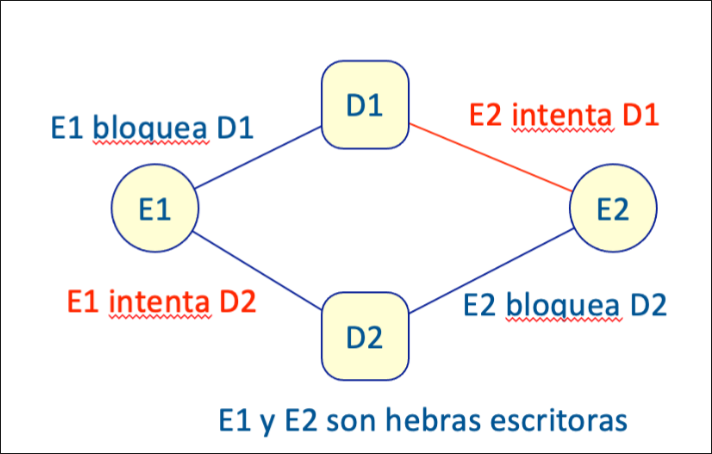

El problema de los lectores/escritores est! planteado con un conjunto de hebras que comparten datos. Una parte de estas hebras (lectores) s"lo leen los datos, mientras que el resto (escritores) leen y escriben. Varios lectores pueden acceder simult!neamente a los datos compartidos, pero se debe evitar que mientras un escritor est# accediendo a los datos acceda a ellos otra hebra de cualquier tipo.

Las hebras correctas deben solicitar permiso para acceder los datos con empiezaLeer (lectores) o empiezaEscribir (escritores). Al terminar de usar los datos compartidos deben invocar a terminaLeer (lectores) o terminaEscribir (escritores). El acceso a los datos compartidos se hace fuera de este monitor. Si este protocolo para acceder a estos m#todos se satisface, se garantiza los requisitos del problema.

| Modifier and Type | Method            | Description                                                         |
|-------------------|-------------------|---------------------------------------------------------------------|
| void              | empiezaEscribir() | Método que invoca una hebra escritora antes de comenzar a escribir |
| void              | empiezaLeer()     | Método que invoca una hebra lectora antes de comenzar a leer       |
| void              | terminaEscribir() | Método que invoca una hebra escritora al terminar de escribir      |
| void              | terminaLeer()     | Método que invoca una hebra lectora al terminar de leer            |

- (a) (2,5 puntos) Sup"ngase que en este sistema hay dos instancias de los datos compartidos: D1 y D2. Algunas hebras escritoras tienen que acceder con exclusi"n mutua simult!neamente a D1 y D2, para cambiar los datos con coherencia. Es imprescindible hacerlo de esta forma. Justifique si en este supuesto podr$a producir interbloqueos.

??? note "Mostrar solución" 
    Si se analizan las condiciones de Coffman:
        - 1. Exclusi"n mutua: es as$, por el enunciado del problema
        - 2. Tener y esperar: en los ejercicios que se han hecho, se usa este esquema. (se podr$a haber propuesto una implementaci"n alternativa)
        - 3. Sin expulsi"n: al igual que en le caso anterior, no hay explusi"n. Se podr$a proporcionar una alternativa.
        - 4. Espera circular: en el enunciado, se indica que hay dos instancias para acceder a los datos y no se especifica en el orden en el que se pueda hacer. Por tanto, puede que haya espera circular, como se muestra a continuaci"n. En este caso, E1 intenta coger D1 y D2, y E2 intenta coger en el otro orden

    

    Se cumplan las cuatro condiciones, por lo que puede ocurrir un interbloqueo.


- (b) (2,5 puntos) A continuaci"n, se muestra una posible soluci"n al problema de los lectores/escritores. Analice este c"digo y justifique si es correcto. En caso contrario, indique los cambios necesarios para que este c"digo fuera una soluci"n correcta.

```java
public class GestorLE2 {
    int nLectores = 0;
    boolean bloqueoLector = false;
    boolean bloqueoEscritor = false;

    public synchronized void empiezaLeer()
            throws InterruptedException {
        int nLectores = 0;
        if (bloqueoEscritor) {
            wait();
        }
        bloqueoLector = true;
        nLectores++;
    }

    public synchronized void empiezaEscribir()
            throws InterruptedException {
        if (bloqueoEscritor || bloqueoLector) {
            wait();
        }
        bloqueoEscritor = true;
    }

    public synchronized void terminaLeer() {
        nLectores--;
        bloqueoLector = false;
        notifyAll();
    }

    public synchronized void terminaEscribir() {
        bloqueoEscritor = false;
        notifyAll();
    }
}
```

??? note "Mostrar solución" 
    El c"digo es incorrecto. Hay que hacer los siguientes cambios:
        - Los atributos tienen que ser privados
        - Los m#todos wait, tienen que estar en un bloque while
        - La declaraci"n nLectores en el m#todo empiezaLeer no tiene sentido
        - En el m#todo terminaLeer s"lo hay asignar true a bloqueoLector cuando no hay lectores.
    
    ```java
    public class GestorLE {
        private boolean bloqueoEscritor = false;
        private boolean bloqueoLector = false;
        private int nLectores = 0;
    
        public synchronized void empiezaLeer(int idLector)
                throws InterruptedException {
            int nLectores = 0;
            while (bloqueoEscritor) {
                wait();
            }
            bloqueoLector = true;
            nLectores++;
        }
    
        public synchronized void empiezaEscribir(int idEscritor)
                throws InterruptedException {
            while (bloqueoEscritor || bloqueoLector) {
                wait();
            }
            bloqueoEscritor = true;
        }
    
        public synchronized void terminaLeer(int idLector) {
            nLectores--;
            if (nLectores == 0) {
                bloqueoLector = false;
                notifyAll();
            }
        }
    
        public synchronized void terminaEscribir(int idEscritor) {
            nEscritores--;
            bloqueoEscritor = false;
            notifyAll();
        }
    }
    ```
