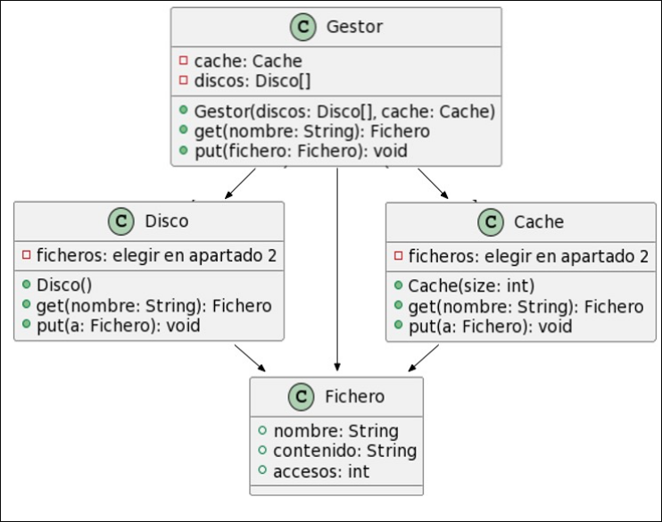

DIT Computers ha decidido implementar un nuevo sistema operativo revolucionario utilizando el lenguaje de programación Java. La primera tarea será implementar un sistema revolucionario de acceso a ficheros, para lo que decide subcontratar a alumnos de ADSW.

Se propone un prototipo de un sistema de ficheros simplificado, que solo permite acceder a ficheros a partir de su nombre, y almacenar nuevos ficheros en el sistema. Habrá cuatro clases en el sistema: 

1. `Fichero`; 
2. `Gestor`, que será la clase principal; 
3. `Disco`, que contendrá un conjunto de ficheros; 
4. `Cache`, para almacenar ficheros que han sido utilizados recientemente y evitar volver a buscarlos. 

La relación entre estas clases se ve en el diagrama adjunto.



El `Gestor` deberá permitir obtener (`get`) ficheros existentes o almacenar (`put`) ficheros nuevos. Internamente, un gestor tiene acceso a un elemento de tipo `Cache` y a varios de tipo `Disco`. Un fichero se obtiene a través de su nombre. Para obtener un fichero, el gestor primero consulta si el fichero está disponible en su caché y, si no, consultará uno a uno a sus discos. En caso de no encontrar el fichero en ninguno de los discos, se devolverá un `null`. Cuando el gestor obtiene el fichero de un disco, lo debe añadir a su caché para que se encuentre más rápido en el próximo acceso. La caché tiene poca capacidad de almacenamiento. Cuando hay que guardar un fichero y no hay capacidad suficiente, se elimina el fichero más antiguo y se almacena el nuevo.

A la hora de guardar el fichero, el gestor asumirá que el fichero es nuevo, y lo guardará tanto en uno de sus discos, como en la caché. Los ficheros deberán distribuirse de manera uniforme entre todos los discos del gestor.

Asuma que el resto de las clases ya están implementadas, de acuerdo al diagrama de clases del enunciado. Pueden añadirse atributos a cualquiera de las clases, pero deberá indicarse.

- (a) (1 punto) Desarrolle método `get` de `Gestor`.

??? note "Mostrar solución"
    ```java
    public class Gestor {
        private Disco[] discos;
        private Cache cache;
        private int puntero = 0;

        public Gestor(Disco[] discos, Cache cache) {
            this.discos = discos;
            this.cache = cache;
        }

        public Archivo get(String nombre) {
            Fichero a = this.cache.get(nombre);
            if (a != null) {
                a.accesos += 1;
                return a;
            }
            for (Disco disco : this.discos) {
                a = disco.get(nombre);
                if (a == null) {
                    continue;
                }
                a.accesos += 1;
                this.cache.put(a);
                return a;
            }
            return null;
        }

    }
    ```


- (b) (1 punto) El método `put` de `Gestor`.

??? note "Mostrar solución"
    ```java
    public void put(Fichero a) {
        this.discos[this.puntero].put(a);
        this.puntero = (this.puntero + 1) % this.discos.length;
    }
    ```


- (c) (2 puntos) En el diagrama de clases, `Disco` y `Cache` no especifican qué estructura de datos utilizan internamente para guardar los ficheros. Siendo `d` el número de discos, `f` el número de ficheros totales almacenados, `c` el número máximo de ficheros que puede contener la caché (con `f >> c`), razone qué estructura de datos (p.e., Lista, Tabla Hash, etc.) utilizaría en `Disco` y en Cache para cumplir que:
    - Obtener un fichero reciente del `Gestor` sea como máximo $O(c)$ en tiempo de ejecución;
    - Obtener un fichero cualquiera del `Gestor` sea como máximo $O(log(f))$ en tiempo de ejecución;
    - Guardar un fichero en el `Gestor` sea como máximo $O(log(f))$ en tiempo de ejecución.

??? note "Mostrar solución"
    Las operaciones en Gestor tendrán una complejidad:

    - `get()` en general es $O(t\_get\_cache + t\_get\_disco * d + t\_put\_cache)$;
    - `get()` de un fichero reciente es $O(t\_get\_cache)$;
    - `put()` es $O(t\_put\_cache + t\_put\_disco)$.
    
    Por tanto, dados los requisitos en complejidad:
    
    - `Cache` podría utilizar cualquiera de las estructuras que hemos visto. La más sencilla sería una lista.
    - `Disco` debería usar una estructura que permita complejidad logarítmica en `get` y `put`. Por ejemplo:
        - Árbol binario
        - `TreeMap`
        - También sería posible usar cualquiera de las opciones de Hash ($O(1)$ en caso mejor, $O(f)$ en caso peor), pero se necesitaría más almacenamiento para evitar colisiones.


- (d) (1 punto) Se desea introducir nuevos tipos de gestores de ficheros con estrategias de acceso y almacenado diferentes. Explique qué cambios introduciría para permitirlo. ¿Y si se quisiera también que `Disco` o `Cache` pudieran reemplazar al gestor de ficheros? Se valorará que los cambios se añadan al diagrama UML, pero no será necesario.

??? note "Mostrar solución"
    Para la primera parte, simplemente sería posible heredando de la clase `Gestor`. No obstante, eso forzaría a que el constructor de `Gestor` siguiera funcionando con esa firma.

    Para la segunda parte, y en general, lo recomendable sería utilizar un Interfaz con los métodos `get` y `put`, como se muestra en el diagrama adjunto.

    Como las 3 clases existentes contienen los métodos necesarios con la misma firma, sólo habría que especificar la nueva herencia (implements).

