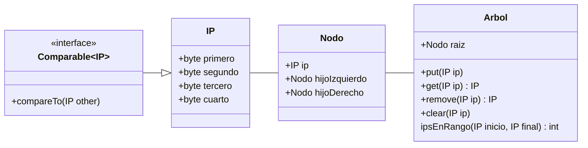
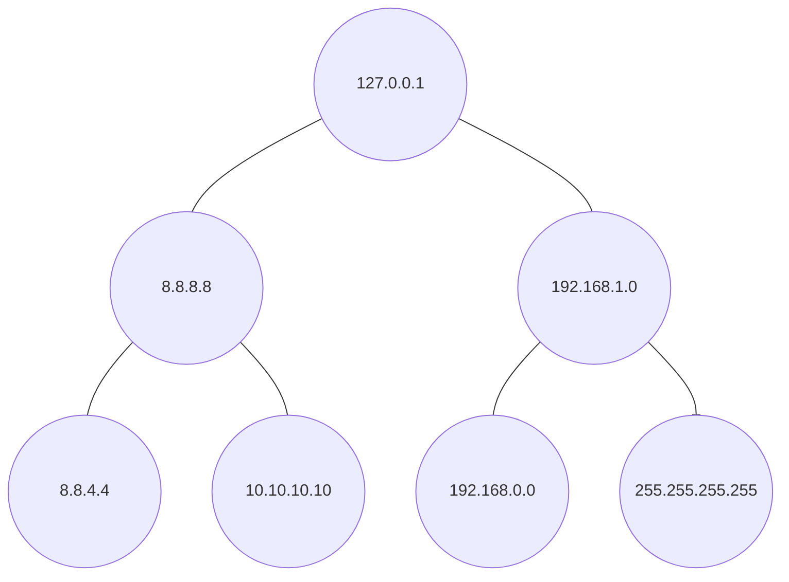

Tenemos un árbol binario de búsqueda en el que almacenamos direcciones `IP`. Las direcciones `IP` son objetos de la clase `IP`, que tiene como atributos los cuatro bytes por los que se compone una `IP`; siendo el primer byte el número decimal situado más a la izquierda y el último byte, el situado a la derecha (ej: en la `IP` 192.168.1.0, el primer byte representa el 192, el segundo el 168, el tercero el 1 y el cuarto el 0).

El árbol binario cuenta con los métodos habituales de un diccionario. Sus nodos tienen referencias a los hijos izquierdo y derecho, y un objeto `IP` que sirve tanto de clave como de valor.



Árbol de ejemplo:



- (a) (1 punto) La clase IP debería implementar la interfaz `Comparable<IP>`, identifique y desarrolle los métodos necesarios para cumplir con dicha interfaz.

??? note "Mostrar solución"
    Una posible solución es
    ```java
	  @Override
      public int compareTo(IP o) {
   	  if(primero > o.primero) return  1;
   	  if(primero < o.primero) return -1;
   	  if(segundo > o.segundo) return  1;
   	  if(segundo < o.segundo) return -1;
   	  if(tercero > o.tercero) return  1;
   	  if(tercero < o.tercero) return -1;
   	  if(cuarto  > o.cuarto ) return  1;
   	  if(cuarto  < o.cuarto ) return -1;
   	  return 0;
    }
    ```


- (b) (2 puntos) Queremos diseñar un método del árbol que nos permita comprobar cuantas IP de las almacenadas están dentro de un rango dado como parámetro (extremos incluidos). Desarrolle el cuerpo del método que tendrá esta cabecera: `public int ipsEnRango(IP inicio, IP final)`. En el árbol de ejemplo, si invocamos el método con los parámetros inicio = 8.8.8.8 y final = 192.168.0.0, el resultado deberá ser 4.

??? note "Mostrar solución"
    ```java
    public int ipsEnRango(IP inicio, IP final) {
      return ipsEnRango(raiz, inicio, final);
      }

    public int ipsEnRango(Nodo nodo, IP inicio, IP final) {
      if ( null == n ) return 0;
      if (n.ip.compareTo(start)>=0 && n.ip.compareTo(end)<=0)
        return 1+ipsEnRango(start, end, n.hijoIzquierdo)+ipsEnRango(start, end, n.hijoDerecho);
      return ipsEnRango(start, end, n.hijoIzquierdo)+ipsEnRango(start, end, n.hijoDerecho);
    }
    ```
    

- (c) (1 punto) ¿Cuál es la complejidad del algoritmo desarrollado?

??? note "Mostrar solución"
    Para comprobar que nodos forman parte del rango debemos recorrer todas las partes del árbol que pudieran pertenecer al rango, haciendo que la complejidad sea $O(n)$.


- (d) (1 punto) Si en vez de un árbol binario, se guardaran las `IP` en un array ordenado, ¿Qué complejidad tendría el método desarrollado en el apartado 2? Razone su respuesta. No es necesario escribir el código, pero puede utilizarse como apoyo a la justificación de la respuesta.

??? note "Mostrar solución"
    Si contamos con un array ordenado, la complejidad será $O(log(n))$. Utilizando búsqueda binaria podemos obtener las posiciones en el array del primer y último elemento que pertenecen al rango y después simplemente restarlas para obtener cuantos elementos hay entre ambas.
