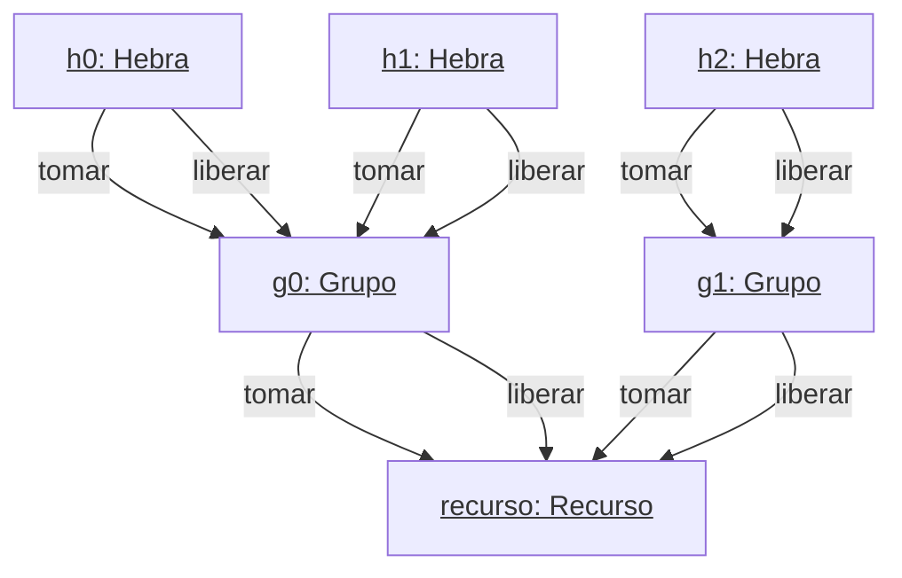
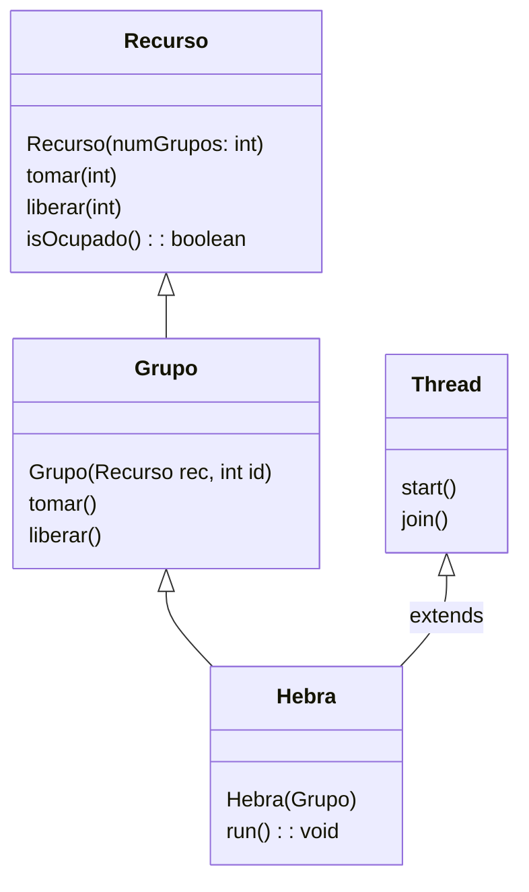

Se desea controlar el acceso de un conjunto de hebras (`Hebra`) a un recurso compartido (`Recurso`).
El acceso al recurso será mediante exclusión mutua.
El recurso se considerará ocupado desde que que se invoca `tomar` hasta que se invoca `liberar`.
Si el recurso ya está ocupado al invocar `tomar`, se bloqueará la ejecución hasta que deje de estarlo.

Además, se quiere separar a las hebras en grupos (`Grupo`) y hacer que el acceso de cada grupo al recurso sea equitativo.
Para ello, el recurso permitirá acceder al recurso de esta manera: primero al grupo con identificador 0, luego al grupo con identificador 1, etc.
Cuando se alcance el número máximo de grupos (`numGrupos`), se volverá a dar acceso al grupo 0.
Si un grupo intenta leer los datos, deberá esperar hasta que sea su turno, incluso aunque el recurso no esté en uso en ese momento.

Dentro de un mismo grupo, el orden de acceso al recurso de cada hebra se deja a su elección como desarrollador.

La clase `Hebra` ya está implementada correctamente.
Suponga que la implementación es equivalente invocar `this.grupo.tomar()` y `this.grupo.liberar()`, en ese orden, un número determinado de veces.


<table>
<tr>
<td>





```java
public static void main(String[] args) {
  Recurso rec = new Recurso(2);
  Grupo g0 = new Grupo(rec, 0);
  Grupo g1 = new Grupo(rec, 1);
  //
  // Código a añadir
  //
  System.out.println("Todas las hebras han acabado");
}
```

</td>
<td>



</td>
</tr>
</table>


Se pide:

1) Complete el método `main` para replicar el escenario mostrado en el diagrama de objetos. Debe esperar a que todas las hebras terminen su ejecución. \[1 punto\]
2) Implemente la clase `Grupo`. Razone, para cada uno de sus métodos, si debe ser sincronizado. \[1.5 puntos\]
3) Implemente la clase `Recurso`. Razone, para cada uno de sus métodos, si debe ser sincronizado. \[3 puntos\]
4) En su solución de los apartados anteriores, ¿puede haber problemas de inanición?. Razone su respuesta. \[0.5 puntos\]


??? note "Mostrar solución"
	1) Complete el método `main` para replicar el escenario mostrado en el diagrama de objetos. Debe esperar a que todas las hebras terminen su ejecución. \[1 punto\]
	
	```java
	public static void main(String[] args) {
	  Recurso rec = new Recurso(2);
	  Grupo g0 = new Grupo(rec, 0);
	  Grupo g1 = new Grupo(rec, 1);
	  //
	  // Código a añadir
	  //
	
	  Hebra h1 = new Hebra(g0);
	  Hebra h2 = new Hebra(g0);
	  Hebra h3 = new Hebra(g1);
	  // Iniciar las hebras
	  h0.start();
	  h1.start();
	  h2.start();
	  // Esperar a que terminen
	  h0.join();
	  h1.join();
	  h2.join();
	  System.out.println("Todas las hebras han acabado");
	}
	```
	
	2) Implemente la clase `Grupo`. Razone, para cada uno de sus métodos, si debe ser sincronizado. \[1.5 puntos\]
	
	```java
	public class Grupo {
	    private Recurso rec;
	    private int id;
	    public Grupo(Recurso rec, int id) {
	        this.rec = rec;
	        this.id = id;
	    }
	
	    // La sincronización se realiza con Recurso
	    // Sólo sería necesario sincronizar si se usaran
	    // datos de esta clase.
	    // p.e., una cola para las hebras.
	    public void tomar() throws InterruptedException {
	        this.rec.tomar(this.id);
	    }
	
	    // Mismos motivos que en tomar
	    public void liberar() throws InterruptedException {
	        this.rec.liberar(this.id);
	    }
	}
	```
	
	3) Implemente la clase `Recurso`. Razone, para cada uno de sus métodos, si debe ser sincronizado. \[3 puntos\]
	
	```java
	public class Recurso {
	    private boolean ocupado = false;
	    private int numGrupos;
	    private int turno;
	    public Recurso(int numGrupos) {
	        this.numGrupos = numGrupos;
	        this.turno = 0;
	        this.ocupado = false;
	    }
	
	    // Debe ser sincronizado para controlar el acceso exclusivo a ocupado y turno
	    public synchronized void tomar(int id) throws InterruptedException {
	        while(this.ocupado || this.turno != id) {
	            wait();
	        }
	        this.ocupado = true;
	    }
	
	    // Debe ser sincronizado para controlar el acceso exclusivo a ocupado y turno
	    public synchronized void liberar(int id) throws InterruptedException {
	        assert id == turno; // Opcional
	        this.turno = (this.turno+1) % this.numGrupos;
	        this.ocupado = false;
	        this.notifyAll(); // Despetar a todos, porque hay diferentes id de grupo
	    }
	
	    // Sincronizado porque puede haber modificación concurrente en tomar o liberar.
	    // Podrían usarse otros mecanismos (p.e., volatile)
	    public synchronized boolean isOcupado() {
	        return this.ocupado;
	    }
	}
	```
	
	4) En su solución de los apartados anteriores, ¿puede haber problemas de inanición?. Razone su respuesta. \[0.5 puntos\]
	
	En la solución dada no hay ningún control de orden de acceso de las hebras de un mismo grupo al recurso. Puede haber inanición.
	
	Podría evitarse implementando algún control simple como una cola FIFO.
		
