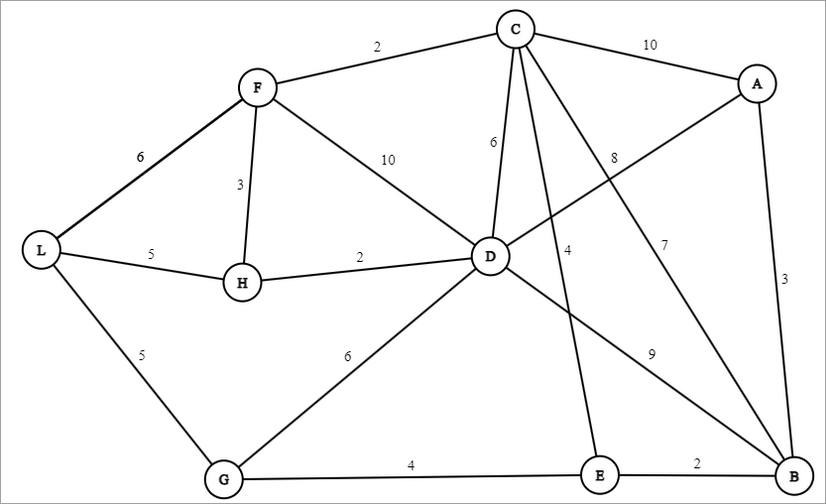

Se nos proporcionan las siguientes clases para modelar un grafo, muy similares a las utilizadas en los laboratorios:
```java
class Nodo {
	public String id;
	public boolean infectado; 
	public List<Arista> vecinos;
	public Nodo(String id) {
		this.id = id; 
		this.infectado = false;
		this.vecinos = new ArrayList<>();
	}
	public void addVecino(Nodo vecino, int peso) {
		vecinos.add(new Arista(vecino, this, peso));
	}      
}  

class Arista {     
	public Nodo a, b;     
	public int peso;      
	public Arista(Nodo a, Nodo b, int peso) {
		this.a = a; 
		this.b = b; 
		this.peso = peso; 
	}
	public Nodo contrario(Nodo nodo) {
	if(a.equals(nodo)) return b;
	return a;
	}
}  
class Grafo {
	public List<Nodo> nodos;
	public Grafo() {
		nodos = new ArrayList<>();
	}
}
```
Este conjunto de clases nos permiten modelar un grafo no dirigido y con pesos. La diferencia con el código utilizado en los laboratorios es la clase `Arista`, que se utiliza para conectar dos `Nodo` y su peso representa la distancia a la que se encuentran dichos nodos. El método `contrario` de la clase `Arista` recibe como parámetro uno de los `Nodo` de los extremos de la arista y devuelve el otro. El atributo `vecinos` de la clase `Nodo` ahora es una lista de objetos `Arista` que llevan a los vecinos.
Se proporciona, además, el siguiente grafo de ejemplo:



Queremos utilizar este modelo de grafos para simular la propagación de un virus. Los nodos pueden estar infectados, esto se refleja en el atributo `infectado`, y pueden propagar el virus a sus vecinos. Un nodo infectado, contagia el virus a todos sus vecinos que estén a una distancia menor o igual a 4. Para saber la distancia entre dos nodos, podemos comprobar el peso de la arista que los conecta. Cuando un nodo contagia a uno de sus vecinos, ese nodo vecino contagiará a su vez a sus vecinos, que a su vez contagiarán a sus vecinos, etc, creando una reacción en cadena.
	
- (a) (0,5 puntos) Suponiendo que en el ejemplo, el nodo 'A' está infectado, al simular la propagación del virus ¿cuántos nodos quedarán infectados?

??? note "Mostrar solución"
    N/A


- (b) (2,5 puntos) Implemente el método `simulaContagios` de la clase `Grafo`, que reciba un `Nodo` como parámetro. Este método deberá cambiar el estado de este nodo a infectado y simular la propagación del virus, según las reglas explicadas anteriormente. El método debe devolver el número de nodos del grafo que han quedado infectados tras la propagación del virus. *Nota*: El algoritmo a desarollar es similar al de calcular los vecinos de orden n del Laboratorio 3.

??? note "Mostrar solución"
    N/A


- (c) (1 punto) Implemente el método `inmunes` que debe devolver un conjunto con los `Nodo` que no pueden ser contagiados por ningún otro `Nodo` con las reglas de propagación dadas.

??? note "Mostrar solución"
    N/A
