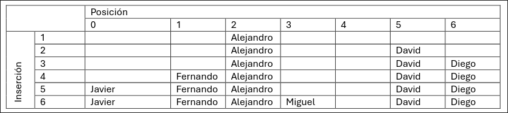

En este problema se trabajará con una tabla hash que almacena los nombres de los alumnos de un curso y sus respectivas notas. La tabla hash funciona con direccionamiento abierto. La resolución de las colisiones se realizará mediante el método de la exploración cuadrática. Esto significa que si al insertar un elemento en la tabla hash se produce una colisión, se elegirá una nueva posición mediante la fórmula (posicion + i^2) % tabla.length, donde i es el número de intentos de reubicación en la tabla y la operación % es el módulo que devuelve el resto de la división.

Se proporciona el siguiente código que realiza la acción de insertar un elemento en la tabla hash:


Se pide:
- (a) (1 punto) Suponga que se tiene una tabla hash como la descrita de tamaño 7. Inserte los siguientes elementos en la tabla hash en el orden que se presentan. Muestre el estado de la tabla después de cada inserción.

| Nombre       | Alejandro | David | Diego | Fernando | Javier | Miguel |
| ------------ | --------- | ----- | ----- | -------- | ------ | ------ |
| Nota         | 10        | 10    | 10    | 10       | 10     | 10     |
| hash(nombre) | 2         | 5     | 5     | 1        | 6      | 6      |

??? note "Mostrar solución"
    - 1. Alejandro se coloca sin colisiones en la posición 2
    - 2. David se coloca sin colisiones en la posición 5
    - 3. Diego colisiona en la posición 5, la siguiente prueba (5 + 1*1) % 7 = 6 es válida
    - 4. Fernando se coloca sin colisiones en la posición 1
    - 5. Javier colisiona en la posición 6, la siguiente prueba (6 + 1*1) % 7 = 0 es válida
    - 6. Miguel colisiona en la posición 6, la siguiente prueba (6 + 1*1) % 7 = 0 también colisiona, la siguiente prueba (6 + 2*2) % 7 = 3 es válida
    
    


- (b) (1 punto) Razone la complejidad algorítmica de la operación de inserción en la tabla hash descrita. Suponga los casos en los que el número de elementos que contiene la tabla es:
    - mucho menor que el tamaño de la tabla.
    - similar al tamaño de la tabla.

??? note "Mostrar solución"
    Si el número de elementos que contiene la tabla es mucho menor que el tamaño de la tabla, la complejidad algorítmica es O(1) ya que se inserta en la primera posición disponible o tras pocas pruebas.

    Si el número de elementos que contiene la tabla es similar al tamaño de la tabla, la complejidad algorítmica es O(n) ya que se debe recorrer la tabla completa para encontrar una posición disponible.


- (c) (2 puntos) Implemente el método buscar(String nombre) que recibe el nombre de un alumno y retorna el objeto ElementoDeTabla correspondiente o null si no lo encuentra.

??? note "Mostrar solución"
    ```java
    public ElementoDeTabla buscar(String nombre) {
        int pos = hash(nombre);
        int intento = 0;

        while (intento < tabla.length) {
            int posicionPrueba = (pos + intento * intento) % tabla.length;
            if (tabla[posicionPrueba] == null) {
                break;
            } else if (tabla[posicionPrueba].getNombre().equals(nombre)) {
                return tabla[posicionPrueba];
            } else {
                intento++;
            }
        }

        return null;
    }
    ```


Suponga ahora que debido a la cantidad de elementos que se quieren almacenar, se decide cambiar el tipo de tabla hash a una tabla con direccionamiento cerrado. En este caso los elementos que colisionen se almacenarán en una lista que se encuentra en la posición que generó la colisión. Puede asumir que la tabla se ha inicializado con listas vacías en cada posición.

- (d) (2 puntos) Implemente el método insertar(ElementoDeTabla alumno) que inserta un nuevo elemento en la tabla hash con direccionamiento cerrado. En caso de colisión, el nuevo elemento se debe agregar a la lista que se encuentra en la posición que generó la colisión. Si ya existe un elemento con el mismo nombre, debe reemplazar su valor.

??? note "Mostrar solución"
    ```java
    public void insertar(ElementoDeTabla alumno) {
        int pos = hash(alumno.getNombre());

        for (ElementoDeTabla e : tabla[pos]) {
            if (e.getNombre().equals(alumno.getNombre())) {
                e.setNota(alumno.getNota());
                return;
            }
        }

        tabla[pos].add(alumno);
    }
    ```
