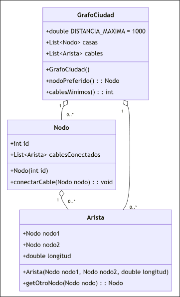

Durante la construcción de una nueva ciudad, se está planificando el despliegue de la red de Internet. Para extender la red, se han empezado a instalar cables de red entre las casas, asegurando que, si una casa tiene conexión a Internet, todas las casas conectadas a ella también la tengan. La salida de la red de la ciudad se realiza con cables de fibra óptica que se conectan a una de las casas, dándole acceso a Internet.

Este escenario se modela como un grafo no dirigido, donde los nodos son las casas y las aristas son los cables de red. En el siguiente diagrama se puede ver cómo se han diseñado las clases que modelan el grafo adjunto.



- (a) (3 puntos) Por problemas de presupuesto, inicialmente solo se contará con un cable de fibra óptica para conectar la red de Internet a la ciudad. Este cable se debe conectar de manera que la cantidad de casas que tengan acceso a Internet sea la máxima posible. Implemente el método `nodoPreferido()` en la clase `GrafoCiudad` que retorne el nodo al que se debe conectar la fibra óptica para que el mayor número de casas tenga conexión. Si hay varias opciones válidas, devuelva cualquiera de ellas.

??? note "Mostrar solución"
    En este apartado se debe buscar la componente conexa más grande del grafo y devolver cualquiera de los nodos que pertenezcan a esa componente. Una posible solución es:

    ```java
    public Nodo nodoPreferido() {
        Set<Nodo> visitados = new HashSet<>();
        int maxEncontrado = 0;
        Nodo maxNodo = null;

        for (Nodo n : casas) {
            if (visitados.contains(n)) continue;
            Set<Nodo> conectados = getConectados(n);
            if (maxEncontrado < conectados.size()) {
                maxEncontrado = conectados.size();
                maxNodo = n;
            }
            visitados.addAll(conectados);
        }

        return maxNodo;
    }

    public Set<Nodo> getConectados(Nodo origen) {
        Set<Nodo> visitados = new HashSet<>();
        List<Nodo> porVisitar = new ArrayList<>();

        visitados.add(origen);
        porVisitar.add(origen);

        while (!porVisitar.isEmpty()) {
            Nodo n = porVisitar.remove(0);
            for (Arista a : n.cablesConectados) {
                Nodo vecino = a.getOtroNodo(n);
                if (!visitados.contains(vecino)) {
                    visitados.add(vecino);
                    porVisitar.add(vecino);
                }
            }
        }

        return visitados;
    }
    ```


- (b) (2 puntos) Cuando avanza la construcción de la ciudad, se decide poner nuevos cables de fibra óptica que traigan la conexión desde fuera de la ciudad. Los cables de fibra se conectarán a una sola casa, de la misma manera que en el apartado anterior. En esta ocasión, se necesita conocer el número mínimo de cables de fibra necesarios para dar conexión a todas las casas. Implemente el método `cablesMinimos()` en la clase `GrafoCiudad` que retorne el número de cables necesarios para garantizar la conectividad de todas las casas.

??? note "Mostrar solución"
    En este apartado se debe calcular el número de componentes conexas que forman el grafo:
    
    ```java
    public int cablesMinimos() {
        Set<Nodo> visitados = new HashSet();
        int componentes = 0;
        for (Nodo n : casas) {
            if (visitados.contains(n)) continue;
            visitados.addAll(getConectados(n));
            componentes++;
        }
        return componentes;
    }
    ```
