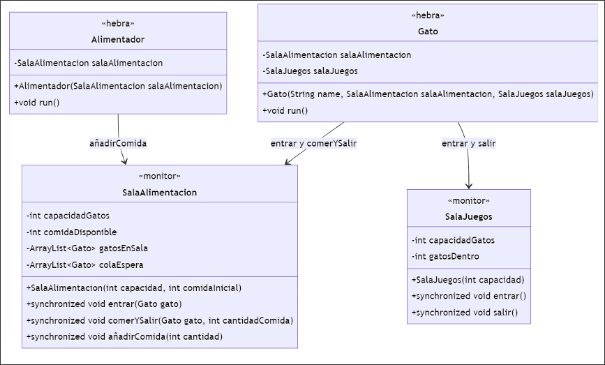

El examen consiste en implementar un sistema concurrente que simule el funcionamiento de un refugio de gatos.

En este refugio, los gatos serán representados por hebras que pueden realizar diferentes actividades (dormir, comer, jugar) y un alimentador que se encarga de añadir comida a la sala de alimentación. Cada gato solo puede hacer una acción a la vez y elige su acción de forma aleatoria. La acción de dormir se realiza simplemente haciendo un sleep().

Requisitos:

Sala de Alimentación:
    - Es un monitor donde los gatos deben entrar en orden de llegada.
    - La sala tiene un contador de cantidad de comida. Puede haber una cantidad infinita de comida.
    - Los gatos pueden entrar si hay huecos libres, siguiendo el orden de llegada.
    - La sala puede albergar hasta un número específico de gatos, determinado por el constructor del monitor.
    - Un gato sale de la sala de alimentación después de comer una cantidad de comida aleatoria entre 1 y 10, que se restará del contador de comida.
    - Si la sala está llena, el gato se queda esperando en la cola.

Sala de Juegos:
    - Es otro monitor donde los gatos pueden entrar si hay huecos libres.
    - No es necesario que los gatos entren en orden de llegada.
    - Si la sala está llena, el gato se quedará esperando.

Comportamiento de la hebra Alimentador:
    - Es una hebra que añade comida a la sala de alimentación.
    - Añade una cantidad de comida aleatoria.

Se ofrece el código del método run() de la hebra Alimentador y un ejemplo del método main().
Diagrama de clases:



Ejemplo de main:
```java
public static void main(String[] args) {
    SalaAlimentacion salaAlimentacion = new SalaAlimentacion(4, 50);
    SalaJuegos salaJuegos = new SalaJuegos(3);
    Alimentador alimentador = new Alimentador(salaAlimentacion);
    alimentador.start();

    ArrayList<Gato> gatos = new ArrayList<>();
    for (int i = 1; i <= 100; i++) {
        Gato gato = new Gato("Gato-" + i, salaAlimentacion, salaJuegos);
        gatos.add(gato);
        gato.start();
    }
}
```

Ejemplo de run de la clase Alimentador:
```java
public void run() {
    Random rand = new Random();
    try {
        while (true) {
            int cantidadComida = rand.nextInt(10);
            salaAlimentacion.añadirComida(cantidadComida);
            Thread.sleep(rand.nextInt(4000));
        }
    } catch (InterruptedException ignored) {
    }
}
```

SE PIDE:
Desarrolla el código del monitor SalaAlimentación:
- (a) (1,5 puntos) Implementa el método public synchronized void entrar(Gato gato) throws InterruptedException

- (b) (1,5 punto) Implementa el método public synchronized void comerYSalir(Gato gato, int cantidadComida) throws InterruptedException

- (c) (1 punto) Implementa el método public synchronized void añadirComida(int cantidad) throws InterruptedException

??? note "Mostrar solución"
    ```java
    public synchronized void entrar(Gato gato) throws InterruptedException {
        while (this.gatosEnSala.size() >= this.capacidad || 
               (this.colaEspera.size() > 0 && this.colaEspera.get(0) != gato)) {
            if (!this.colaEspera.contains(gato)) {
                this.colaEspera.add(gato);
                System.out.println(gato.getName() + " está esperando para entrar a la sala de alimentación.");
            }
            wait();
        }

        if (this.colaEspera.contains(gato)) {
            this.colaEspera.remove(gato); // Quitar el gato de la cola de espera cuando se despierte
        }

        this.gatosEnSala.add(gato);
        System.out.println(gato.getName() + " entró a la sala de alimentación.");
        notifyAll();
    }

    public synchronized void comerYSalir(Gato gato, int cantidadComida) throws InterruptedException {
        while (!this.gatosEnSala.contains(gato) || this.cantidadComida < cantidadComida) {
            wait();
        }

        this.cantidadComida -= cantidadComida;
        this.gatosEnSala.remove(gato);
        System.out.println(gato.getName() + " comió " + cantidadComida +
                           " unidades de comida. Comida restante: " + this.cantidadComida);
        notifyAll();
    }

    public synchronized void añadirComida(int cantidad) throws InterruptedException {
        this.cantidadComida += cantidad;
        System.out.println("Alimentador añadió " + cantidad +
                           " unidades de comida. Comida disponible: " + this.cantidadComida);
        notifyAll();
    }
    ```


Desarrolla el código del monitor SalaJuegos:

- (d) (0,5 puntos) Implementa el método public synchronized void entrar() throws InterruptedException

- (e) (0,5 puntos) Implementa el método public synchronized void salir() throws InterruptedException

??? note "Mostrar solución"
    ```java
    public synchronized void entrar() throws InterruptedException {
        while (this.gatosDentro >= this.capacidadGatos) {
            wait();
        }
        this.gatosDentro++;
        System.out.println("Entró un gato a la sala de juegos. Gatos dentro: " + gatosDentro);
    }

    public synchronized void salir() throws InterruptedException {
        if (this.gatosDentro > 0) {
            this.gatosDentro--;
        }
        System.out.println("Salió un gato de la sala de juegos. Gatos dentro: " + gatosDentro);
        notifyAll();
    }
    ```

