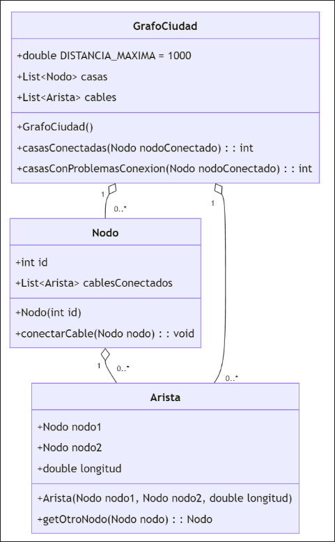

Durante la construcción de una nueva ciudad se está planificando el despliegue de la red de Internet. Para extender la red se han empezado a instalar cables de red entre las casas, haciendo que, si una casa tiene conexión a Internet, todas las casas conectadas a ella también la tengan. La salida de la red de la ciudad se realiza con cables de fibra óptica que se conectan a una de las casas dándole acceso a Internet.

Este escenario modela como un grafo no dirigido, donde los nodos son las casas y las aristas son los cables de red. En el siguiente diagrama se puede ver como se han diseñado las clases que modelan el grafo adjunto.



- (a) (2 puntos) Por problemas de presupuesto, inicialmente solo se contará con 1 cable de fibra óptica para conectar la red de Internet a la ciudad. Este cable se debe conectar de manera que la cantidad de casas que tengan acceso a Internet sea la máxima posible. Implemente el método casasConectadas(Nodo nodoConectado) en la clase GrafoCiudad que retorne la cantidad de casas que tendrían acceso a Internet si se conectara el cable de fibra óptica al nodo nodoConectado.

??? note "Mostrar solución"
    Opción BST:
    ```java
    public int casasConectadas(Nodo nodoConectado) {
            Set<Nodo> visitados = new HashSet<>();
            List<Nodo> aVisitar = new ArrayList<>();

            aVisitar.add(nodoConectado);
            visitados.add(nodoConectado);

            while (!aVisitar.isEmpty()) {
                Nodo actual = aVisitar.remove(0);
                for (Arista arista : actual.cablesConectados) {
                    Nodo vecino = arista.getOtroNodo(actual);
                    if (!visitados.contains(vecino)) {
                        visitados.add(vecino);
                        aVisitar.add(vecino);
                    }
                }
            }

            return visitados.size();
        }
        ```

        Opción Dijkstra
        ```java
    public int casasConectadasDijkstra(Nodo nodoConectado) {
        HashMap<Nodo, Double> distancias = dijkstra(nodoConectado);
        return distancias.size();
    }

    private void relax(Arista arista, Nodo nodoConectado, HashMap<Nodo, Double> distancias,
                       List<Nodo> aVisitar) {
        Nodo vecino = arista.getOtroNodo(nodoConectado);
        double nuevaDistancia = distancias.get(nodoConectado) + arista.longitud;

        if (!distancias.containsKey(vecino) || distancias.get(vecino) > nuevaDistancia) {
            distancias.put(vecino, nuevaDistancia);
            if (!aVisitar.contains(vecino))
                aVisitar.add(vecino);
        }
    }

    private Nodo extraerMenor(List<Nodo> aVisitar, HashMap<Nodo, Double> distancias) {
        Nodo menor = aVisitar.get(0);
        for (Nodo nodo : aVisitar) {
            if (distancias.get(nodo) < distancias.get(menor)) {
                menor = nodo;
            }
        }
        aVisitar.remove(menor);
        return menor;
    }

    private HashMap<Nodo, Double> dijkstra(Nodo nodoConectado) {
        Set<Nodo> visitados = new HashSet<>();
        HashMap<Nodo, Double> distancias = new HashMap<>();
        List<Nodo> aVisitar = new ArrayList<>();

        aVisitar.add(nodoConectado);
        distancias.put(nodoConectado, 0.0);

        while (!aVisitar.isEmpty()) {
            Nodo actual = extraerMenor(aVisitar, distancias);
            visitados.add(actual);

            for (Arista arista : actual.cablesConectados) {
                if (visitados.contains(arista.getOtroNodo(actual))) {
                    continue;
                }
                relax(arista, actual, distancias, aVisitar);
            }
        }

        return distancias;
    }
    ```


- (b) (3 puntos) Desafortunadamente, el cable utilizado dentro de la ciudad no es de la mejor calidad y se ha detectado que las casas más alejadas de la casa conectada a la fibra óptica tienen problemas de conexión. El umbral de distancia para que una casa tenga problemas de conexión es de 1000 metros, guardado en la constante DISTANCIA_MAXIMA en la clase `GrafoCiudad`. Implemente el método `casasConProblemasConexion(Nodo nodoConectado)` en la clase `GrafoCiudad` que retorne la cantidad de casas que tendrían problemas de conexión si se conectara el cable de fibra óptica al nodo `nodoConectado`. Nota: las casas con problemas de conexión deben tener acceso a Internet.

??? note "Mostrar solución"
    Opción BST:
    ```java
    public int casasConProblemasConexion(Nodo nodoConectado) {
        List<Nodo> aVisitar = new ArrayList<>();
        HashMap<Nodo, Double> distancias = new HashMap<>();

        aVisitar.add(nodoConectado);
        distancias.put(nodoConectado, 0.0);

        while (!aVisitar.isEmpty()) {
            Nodo actual = aVisitar.remove(0);

            for (Arista arista : actual.cablesConectados) {
                Nodo vecino = arista.getOtroNodo(actual);
                double nuevaDistancia = distancias.get(actual) + arista.longitud;

                if (!distancias.containsKey(vecino) || distancias.get(vecino) > nuevaDistancia) {
                    distancias.put(vecino, nuevaDistancia);
                    aVisitar.add(vecino);
                }
            }
        }

        int contador = 0;
        for (Nodo casa : distancias.keySet()) {
            if (distancias.get(casa) > DISTANCIA_MAXIMA) {
                contador++;
            }
        }

        return contador;
    }
    ```

    Opción Dijkstra:
    ```java
    public int casasConProblemasConexionDijkstra(Nodo nodoConectado) {
        HashMap<Nodo, Double> distancias = dijkstra(nodoConectado);
        int contador = 0;
    
        for (Nodo casa : distancias.keySet()) {
            if (distancias.get(casa) > DISTANCIA_MAXIMA) {
                contador++;
            }
        }
    
        return contador;
    }
    ```
