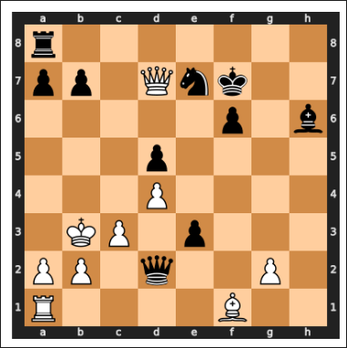

Suponga que se tiene una variable `tableroPruebas` que contiene un tablero con las piezas dispuestas como en la imagen siguiente. 

- (a) (4 puntos) Diseñe una prueba que compruebe que se calculan correctamente las puntuaciones de cada uno de los bandos.



| Pieza   | Puntos |
| ------- | ------ |
| Rey     | 100    |
| Reina   | 9      |
| Torre   | 5      |
| Alfil   | 3      |
| Caballo | 3      |
| Peón    | 1      |

??? note "Mostrar solución"
    ```java
    @Test
    public void pruebaExamen() {
        assertEquals(122, tableroPruebas.getPuntuacionBando(Bando.BLANCAS));
        assertEquals(125, tableroPruebas.getPuntuacionBando(Bando.NEGRA));
    }
    ```
